# 03_Functional_Analysis.md — Phân tích chức năng

> Tài liệu trước: [02_Requirement.md](02_Requirement.md)
> Tài liệu sau: [04_System_Architecture.md](04_System_Architecture.md) và [05_Domain_Model.md](05_Domain_Model.md)
> Trạng thái: Chưa hoàn thành

---

## 1. User Stories

### Auth

| ID    | User Story                                                                                                     | FR liên quan | Module |
| ----- | -------------------------------------------------------------------------------------------------------------- | ------------ | ------ |
| US-01 | Là người dùng, tôi muốn đăng ký tài khoản bằng email và mật khẩu để sử dụng ứng dụng.                        | FR-AUTH-01   | Auth   |
| US-02 | Là người dùng, tôi muốn đăng nhập bằng tài khoản đã đăng ký để truy cập dữ liệu cá nhân.                    | FR-AUTH-02   | Auth   |
| US-03 | Là người dùng, tôi muốn đăng xuất khỏi hệ thống để đảm bảo an toàn cho tài khoản.                           | FR-AUTH-04   | Auth   |
| US-04 | Là người dùng, tôi muốn cập nhật thông tin cá nhân để thông tin tài khoản luôn chính xác.                    | FR-AUTH-06   | Auth   |
| US-05 | Là người dùng, tôi muốn thay đổi mật khẩu khi cần để tăng tính bảo mật.                                     | FR-AUTH-07   | Auth   |

---

### Space

| ID    | User Story                                                                                                                                      | FR liên quan | Module |
| ----- | ----------------------------------------------------------------------------------------------------------------------------------------------- | ------------ | ------ |
| US-06 | Là người dùng, tôi muốn tạo một Space theo chủ đề riêng để quản lý mọi thứ liên quan trong đó mà không phải phân vân nó thuộc "Học" hay "Việc". | FR-SPACE-01  | Space  |
| US-07 | Là người dùng, tôi muốn xem danh sách các Space của mình để nhanh chóng chọn không gian cần làm việc.                                           | FR-SPACE-02  | Space  |
| US-08 | Là người dùng, tôi muốn đổi tên hoặc sắp xếp thứ tự ưu tiên.                                                                                    | FR-SPACE-04  | Space  |
| US-09 | Là người dùng, tôi muốn xoá một Space khi không còn cần đến để giữ danh sách gọn gàng.                                                          | FR-SPACE-05  | Space  |

---

### Task

| ID    | User Story                                                                                                     | FR liên quan              | Module |
| ----- | -------------------------------------------------------------------------------------------------------------- | ------------------------- | ------ |
| US-10 | Là người dùng, tôi muốn tạo công việc mới trong một Space để theo dõi những gì cần thực hiện.                | FR-TASK-01                | Task   |
| US-11 | Là người dùng, tôi muốn chỉnh sửa thông tin công việc để cập nhật khi có thay đổi.                          | FR-TASK-04                | Task   |
| US-12 | Là người dùng, tôi muốn xoá công việc không còn cần thiết để danh sách luôn gọn gàng.                       | FR-TASK-05                | Task   |
| US-13 | Là người dùng, tôi muốn đánh dấu công việc đã hoàn thành để theo dõi tiến độ.                               | FR-TASK-06                | Task   |
| US-14 | Là người dùng, tôi muốn đặt deadline và mức độ ưu tiên cho công việc để sắp xếp thứ tự xử lý.               | FR-TASK-01                | Task   |
| US-15 | Là người dùng, tôi muốn tìm kiếm và lọc công việc để nhanh chóng tìm được nội dung cần thiết.               | FR-TASK-09                | Task   |
| US-16 | Là người dùng, tôi muốn gắn Tag cho công việc để dễ phân loại và tìm kiếm.                                  | FR-TASK-10                | Task   |

---

### Note

| ID    | User Story                                                                                              | FR liên quan | Module |
| ----- | ------------------------------------------------------------------------------------------------------- | ------------ | ------ |
| US-17 | Là người dùng, tôi muốn tạo ghi chú trong một Space để lưu lại suy nghĩ, tóm tắt bài học hoặc kế hoạch. | FR-NOTE-01   | Note   |
| US-18 | Là người dùng, tôi muốn chỉnh sửa nội dung ghi chú để cập nhật khi có thông tin mới.                    | FR-NOTE-04   | Note   |
| US-19 | Là người dùng, tôi muốn xoá ghi chú không còn cần thiết.                                                | FR-NOTE-05   | Note   |
| US-20 | Là người dùng, tôi muốn tìm kiếm ghi chú theo tiêu đề để truy cập nhanh khi cần.                        | FR-NOTE-08   | Note   |

---

### Event

| ID    | User Story                                                                                                     | FR liên quan              | Module |
| ----- | -------------------------------------------------------------------------------------------------------------- | ------------------------- | ------ |
| US-21 | Là người dùng, tôi muốn tạo sự kiện trong một Space để ghi lại các buổi họp, lịch học hoặc deadline quan trọng. | FR-EVENT-01            | Event  |
| US-22 | Là người dùng, tôi muốn chỉnh sửa hoặc xoá sự kiện khi kế hoạch thay đổi.                                   | FR-EVENT-03, FR-EVENT-04  | Event  |

---

### Reference

| ID    | User Story                                                                                                     | FR liên quan | Module    |
| ----- | -------------------------------------------------------------------------------------------------------------- | ------------ | --------- |
| US-23 | Là người dùng, tôi muốn lưu link tài liệu tham khảo vào một Space để không phải tìm lại mỗi lần cần.        | FR-REF-01    | Reference |
| US-24 | Là người dùng, tôi muốn gắn Tag cho tài liệu tham khảo để phân loại và tìm nhanh hơn.                       | FR-REF-06    | Reference |

---

### Relation

| ID    | User Story                                                                                                                         | FR liên quan     | Module   |
| ----- | ---------------------------------------------------------------------------------------------------------------------------------- | ----------------- | -------- |
| US-25 | Là người dùng, tôi muốn liên kết ghi chú với công việc để biết tài liệu nào phục vụ cho việc nào.           | FR-REL-01         | Relation |
| US-26 | Là người dùng, tôi muốn đặt nhãn tự do cho mối liên kết giữa 2 Object (ví dụ: "cần làm trước", "tham khảo") để thể hiện đúng mối quan hệ theo cách tôi hiểu. | FR-REL-01         | Relation |
| US-27 | Là người dùng, tôi muốn liên kết tài liệu tham khảo với sự kiện để chuẩn bị sẵn trước buổi họp.            | FR-REL-01         | Relation |
| US-28 | Là người dùng, tôi muốn xem tất cả nội dung đang liên kết với một Object cụ thể (cả 2 chiều) để nắm được toàn bộ context. | FR-REL-02         | Relation |

---

### Placement — Đặt Object vào Space

| ID    | User Story                                                                                                                                      | FR liên quan     | Module    |
| ----- | ----------------------------------------------------------------------------------------------------------------------------------------------- | ----------------- | --------- |
| US-29 | Là người dùng, tôi muốn đặt một ghi chú vào cả Space “Đồ án” lẫn Space “Học NestJS” vì nó liên quan đến cả hai, không muốn sao chép. | FR-PLACE-02       | Placement |
| US-30 | Là người dùng, tôi muốn gỡ một công việc khỏi Space mà không xóa nó, vì nó vẫn có thể nằm ở Space khác hoặc chỉ đơn giản chưa cần gắn vào đâu. | FR-PLACE-03       | Placement |
| US-31 | Là người dùng, tôi muốn xem danh sách các nội dung chưa được gắn vào Space nào (Unassigned) để không để thông tin thất lạc. | FR-PLACE-05       | Placement |

---

### Vòng đời Object (Lifecycle)

| ID    | User Story                                                                                                                                        | FR liên quan     | Module  |
| ----- | ------------------------------------------------------------------------------------------------------------------------------------------------- | ----------------- | ------- |
| US-32 | Là người dùng, tôi muốn đưa một ghi chú vào Archive khi không dùng thường xuyên nhưng vẫn muốn giữ lại.                                 | FR-TASK-05 (*)    | Object  |
| US-33 | Là người dùng, tôi muốn chuyển nội dung không cần vào Trash trước khi quyết định xóa vĩnh viễn để tránh xóa nhầm.                  | FR-TASK-05 (*)    | Object  |
| US-34 | Là người dùng, tôi muốn khôi phục một nội dung từ Trash nếu lỡ tay xóa.                                                             | FR-TASK-05 (*)    | Object  |

---

### View

| ID    | User Story                                                                                                     | FR liên quan | Module |
| ----- | -------------------------------------------------------------------------------------------------------------- | ------------ | ------ |
| US-35 | Là người dùng, tôi muốn xem lịch theo ngày/tuần/tháng để theo dõi deadline và sự kiện sắp đến.              | FR-VIEW-01   | View   |
| US-36 | Là người dùng, tôi muốn xem toàn bộ nội dung trong một Space dạng danh sách để có cái nhìn tổng thể.        | FR-VIEW-02   | View   |
| US-37 | Là người dùng, tôi muốn xem công việc theo bảng Kanban để quản lý tiến độ trực quan hơn.                    | FR-VIEW-03   | View   |

---

### Dashboard

| ID    | User Story                                                                                                                                 | FR liên quan | Module    |
| ----- | ------------------------------------------------------------------------------------------------------------------------------------------ | ------------ | --------- |
| US-38 | Là người dùng, tôi muốn xem ngay trên Dashboard những công việc và sự kiện sắp đến hạn để biết mình cần ưu tiên cái gì. | FR-DASH-01   | Dashboard |
| US-39 | Là người dùng, tôi muốn xem thống kê tổng quan công việc theo trạng thái để đánh giá nhanh tiến độ.                         | FR-DASH-02   | Dashboard |
| US-40 | Là người dùng, tôi muốn truy cập nhanh vào Space hoặc công việc từ Dashboard để thao tác thuận tiện.                     | FR-DASH-05   | Dashboard |

---

### Notification

| ID    | User Story                                                                                                     | FR liên quan  | Module       |
| ----- | -------------------------------------------------------------------------------------------------------------- | ------------- | ------------ |
| US-34 | Là người dùng, tôi muốn nhận thông báo khi công việc hoặc sự kiện sắp đến hạn để không bỏ lỡ.               | FR-NOTIF-01   | Notification |
| US-35 | Là người dùng, tôi muốn xem danh sách các thông báo chưa đọc để không bỏ lỡ thông tin quan trọng.           | FR-NOTIF-02   | Notification |
| US-36 | Là người dùng, tôi muốn đánh dấu thông báo đã đọc sau khi xem để dễ quản lý.                                | FR-NOTIF-04   | Notification |

---

## 2. Use Case Diagram (Sơ đồ Use Case)

### Sơ đồ Tổng quan
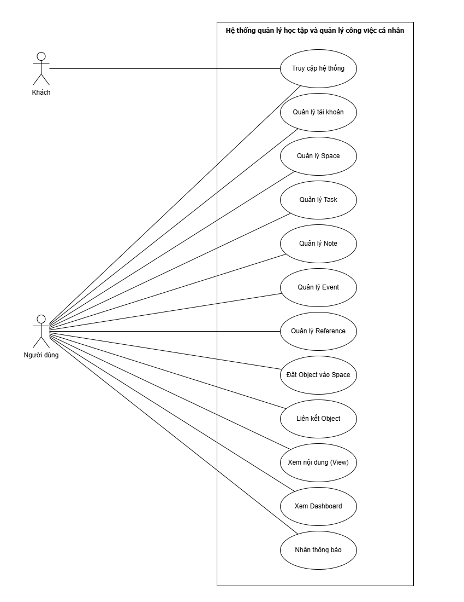

### Các sơ đồ chi tiết theo Module

**Module Xác thực:**
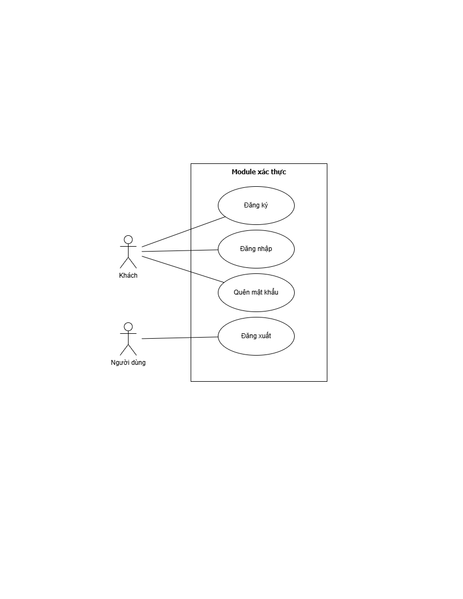

**Module Quản lý tài khoản:**
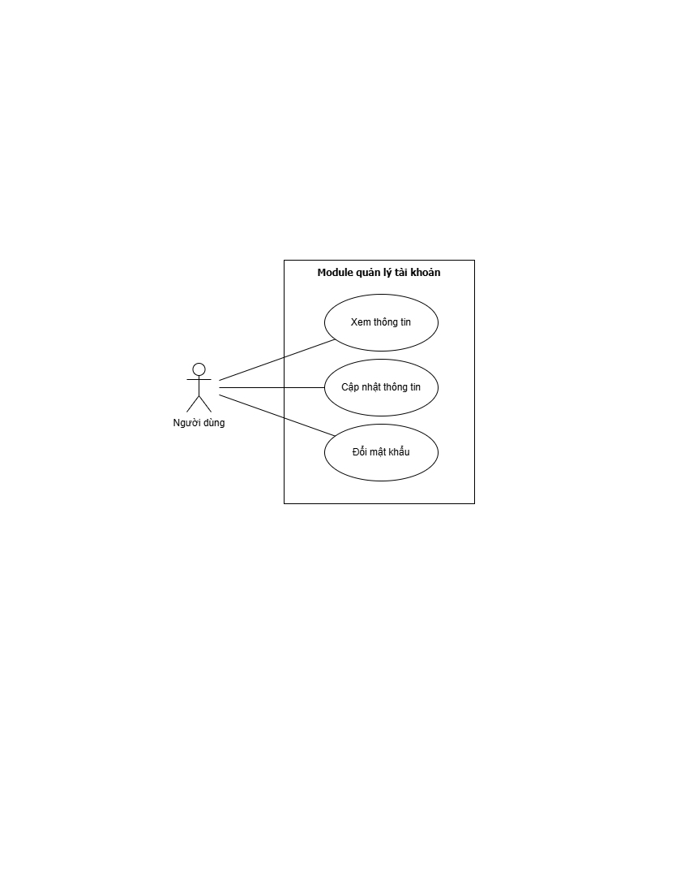

**Module Quản lý Space:**
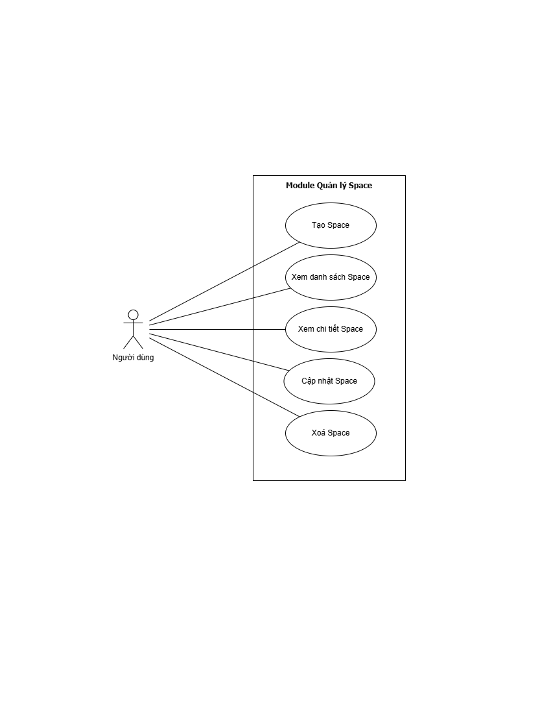

**Module Quản lý Task:**
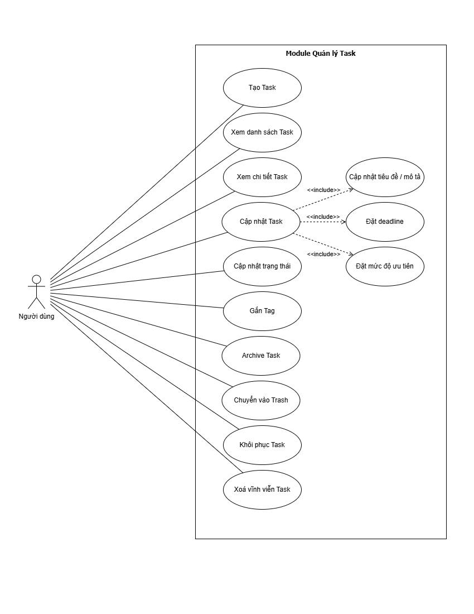

**Module Lifecycle Object:**
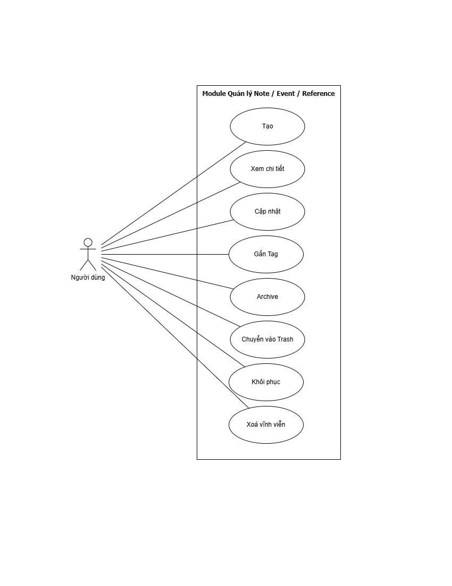

**Module Placement:**
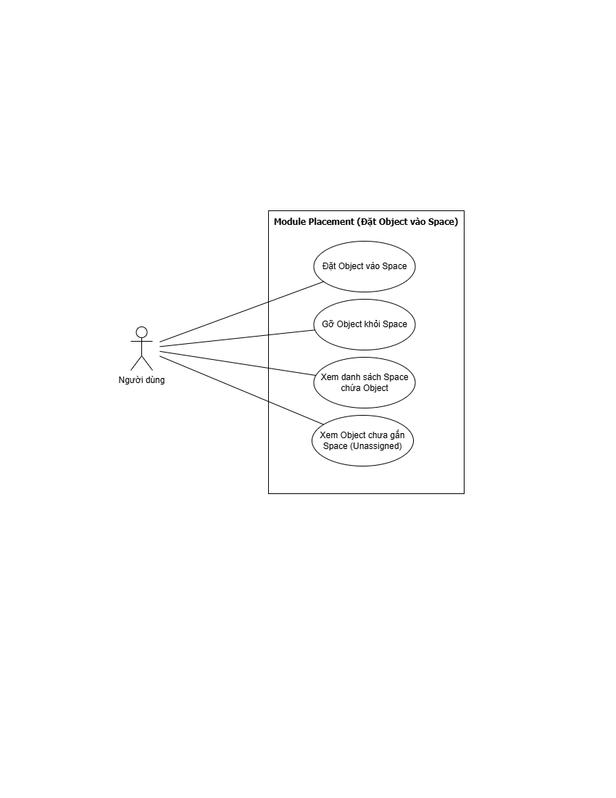

**Module Relation:**
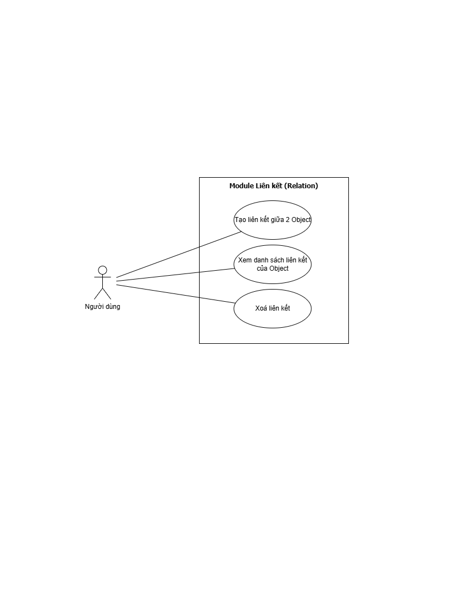

**Module View / Dashboard / Notification:**
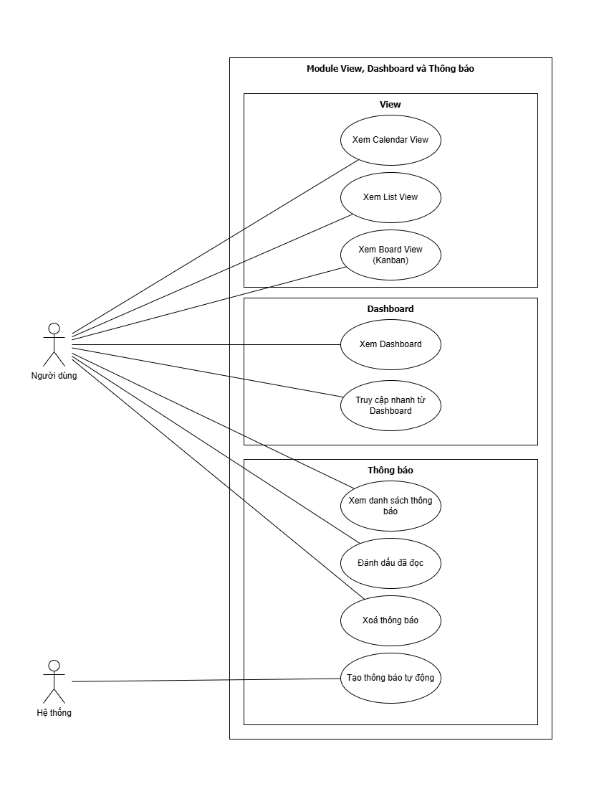

---

## 3. Chi tiết Use Case

> Mô tả các Use Case quan trọng hoặc có nhiều Business Rule. Các UC đơn giản (xem danh sách, xem chi tiết) không cần mô tả riêng.

---

### UC-01: Đăng ký tài khoản

| | |
|---|---|
| **Actor** | Khách (chưa đăng nhập) |
| **Precondition** | Người dùng chưa có tài khoản trong hệ thống |
| **Trigger** | Người dùng nhấn nút "Đăng ký" |
| **Main Flow** | 1. Người dùng nhập họ tên, email và mật khẩu   2. Hệ thống kiểm tra email chưa tồn tại trong hệ thống   3. Hệ thống kiểm tra mật khẩu tối thiểu 8 ký tự   4. Hệ thống tạo tài khoản, hash mật khẩu   5. Hệ thống chuyển người dùng sang trang đăng nhập |
| **Alternative Flow** | 2a. Email đã tồn tại → hiển thị lỗi "Email đã được đăng ký"   3a. Mật khẩu dưới 8 ký tự → hiển thị lỗi "Mật khẩu tối thiểu 8 ký tự" |
| **Postcondition** | Tài khoản được tạo trong database, chưa có Space hay Object nào |
| **FR liên quan** | FR-AUTH-01 |

---

### UC-02: Đăng nhập

| | |
|---|---|
| **Actor** | Khách (chưa đăng nhập) |
| **Precondition** | Người dùng đã có tài khoản |
| **Trigger** | Người dùng nhấn nút "Đăng nhập" |
| **Main Flow** | 1. Người dùng nhập email và mật khẩu   2. Hệ thống kiểm tra email tồn tại   3. Hệ thống so sánh mật khẩu đã hash   4. Hệ thống tạo JWT token   5. Hệ thống chuyển người dùng vào trang Dashboard |
| **Alternative Flow** | 2a. Email không tồn tại → hiển thị lỗi "Email hoặc mật khẩu không đúng"   3a. Mật khẩu sai → hiển thị lỗi "Email hoặc mật khẩu không đúng" (dùng chung thông báo để tránh lộ thông tin) |
| **Postcondition** | Người dùng được xác thực, có JWT token hợp lệ, truy cập được các chức năng |
| **FR liên quan** | FR-AUTH-02, FR-AUTH-03 |

---

### UC-03: Quên mật khẩu

| | |
|---|---|
| **Actor** | Khách (chưa đăng nhập) |
| **Precondition** | Người dùng có tài khoản và truy cập được email đã đăng ký |
| **Trigger** | Người dùng nhấn "Quên mật khẩu" |
| **Main Flow** | 1. Người dùng nhập địa chỉ email   2. Hệ thống kiểm tra email tồn tại trong hệ thống   3. Hệ thống tạo link đặt lại mật khẩu có thời hạn và gửi về email   4. Người dùng mở email, nhấn vào link   5. Người dùng nhập mật khẩu mới và xác nhận lại   6. Hệ thống cập nhật mật khẩu mới, huỷ link vừa dùng   7. Hệ thống chuyển người dùng về trang đăng nhập |
| **Alternative Flow** | 2a. Email không tồn tại → vẫn hiển thị "Nếu email hợp lệ, bạn sẽ nhận được hướng dẫn" (không tiết lộ email có hay không)   5a. Mật khẩu mới dưới 8 ký tự → hiển thị lỗi   5b. Mật khẩu mới và xác nhận không khớp → hiển thị lỗi |
| **Postcondition** | Mật khẩu được cập nhật; link đặt lại bị vô hiệu hoá |
| **FR liên quan** | FR-AUTH-08, FR-AUTH-09 |

---

### UC-04: Cập nhật thông tin cá nhân

| | |
|---|---|
| **Actor** | Người dùng đã đăng nhập |
| **Precondition** | Người dùng đang ở trang cài đặt tài khoản |
| **Trigger** | Người dùng nhấn "Chỉnh sửa thông tin" |
| **Main Flow** | 1. Hệ thống hiển thị form với thông tin hiện tại (họ tên, ảnh đại diện)   2. Người dùng chỉnh sửa thông tin mong muốn   3. Người dùng nhấn "Lưu"   4. Hệ thống cập nhật thông tin vào database   5. Hệ thống hiển thị thông báo "Cập nhật thành công" |
| **Alternative Flow** | 2a. Họ tên để trống → hiển thị lỗi "Họ tên không được để trống" |
| **Postcondition** | Thông tin cá nhân được cập nhật, hiển thị ngay trên giao diện |
| **FR liên quan** | FR-AUTH-06 |

---

### UC-05: Tạo Space

| | |
|---|---|
| **Actor** | Người dùng đã đăng nhập |
| **Precondition** | Người dùng đang ở màn hình danh sách Space |
| **Trigger** | Người dùng nhấn nút "Tạo Space mới" |
| **Main Flow** | 1. Người dùng nhập tên Space (bắt buộc), mô tả và chọn màu (tuỳ chọn)   2. Hệ thống kiểm tra tên không để trống   3. Hệ thống tạo Space, gắn `ownerId` với người dùng hiện tại   4. Hệ thống chuyển vào trang chi tiết Space vừa tạo |
| **Alternative Flow** | 2a. Tên để trống → hiển thị lỗi "Tên Space không được để trống" |
| **Postcondition** | Space được tạo, hiển thị trong danh sách Space của người dùng. Chưa có Object nào bên trong. |
| **FR liên quan** | FR-SPACE-01 |

---

### UC-06: Xoá Space

| | |
|---|---|
| **Actor** | Người dùng đã đăng nhập |
| **Precondition** | Space tồn tại và thuộc về người dùng hiện tại |
| **Trigger** | Người dùng chọn "Xoá Space" |
| **Main Flow** | 1. Hệ thống hiển thị hộp thoại xác nhận: "Xoá Space sẽ gỡ tất cả Object ra khỏi Space này. Các Object vẫn được giữ lại."   2. Người dùng xác nhận xoá   3. Hệ thống xoá tất cả bản ghi `SpaceObject` liên quan đến Space này   4. Hệ thống xoá Space khỏi database   5. Hệ thống chuyển người dùng về danh sách Space |
| **Alternative Flow** | 2a. Người dùng huỷ → không có gì thay đổi |
| **Postcondition** | Space bị xoá. Các Object từng nằm trong Space vẫn tồn tại trong hệ thống (ở Space khác hoặc Unassigned). |
| **FR liên quan** | FR-SPACE-05 |

---

### UC-07: Tạo Task

| | |
|---|---|
| **Actor** | Người dùng đã đăng nhập |
| **Precondition** | Người dùng đang xem nội dung một Space hoặc ở khu vực Unassigned |
| **Trigger** | Người dùng nhấn "Tạo Task mới" |
| **Main Flow** | 1. Người dùng nhập tiêu đề Task (bắt buộc)   2. Người dùng nhập mô tả, chọn deadline, mức độ ưu tiên (tuỳ chọn)   3. Hệ thống kiểm tra tiêu đề không để trống   4. Hệ thống kiểm tra deadline không ở quá khứ (nếu có nhập)   5. Hệ thống tạo Object (type=TASK) với `ownerId` là người dùng hiện tại, trạng thái mặc định Todo   6. Nếu người dùng đang trong một Space, hệ thống tự động tạo bản ghi `SpaceObject` đặt Task vào Space đó   7. Hệ thống hiển thị Task vừa tạo trong danh sách |
| **Alternative Flow** | 3a. Tiêu đề để trống → hiển thị lỗi "Tiêu đề không được để trống"   4a. Deadline ở quá khứ → hiển thị lỗi "Deadline không được ở quá khứ" |
| **Postcondition** | Task được tạo. Nếu tạo từ trong Space thì tự động được đặt vào Space đó qua SpaceObject. |
| **FR liên quan** | FR-TASK-01 |

---

### UC-08: Cập nhật trạng thái Task

| | |
|---|---|
| **Actor** | Người dùng đã đăng nhập |
| **Precondition** | Task tồn tại, thuộc người dùng, đang ở trạng thái active |
| **Trigger** | Người dùng chọn trạng thái mới cho Task |
| **Main Flow** | 1. Người dùng chọn trạng thái mới (Todo / Doing / Done)   2. Hệ thống cập nhật trạng thái Task   3. Hệ thống cập nhật hiển thị ngay trên giao diện |
| **Alternative Flow** | 2a. Task vừa chuyển sang Done và có thông báo nhắc nhở đang chờ → hệ thống huỷ thông báo đó |
| **Postcondition** | Trạng thái Task được cập nhật. Task Done không còn nhận thông báo nhắc nhở. |
| **FR liên quan** | FR-TASK-06 |

---

### UC-09: Gắn Tag cho Object

| | |
|---|---|
| **Actor** | Người dùng đã đăng nhập |
| **Precondition** | Object tồn tại, thuộc người dùng. Object là Task, Note hoặc Reference. |
| **Trigger** | Người dùng chọn "Gắn Tag" trong trang chi tiết Object |
| **Main Flow** | 1. Hệ thống hiển thị danh sách Tag hiện có của người dùng và ô nhập Tag mới   2a. Người dùng chọn Tag đã có → hệ thống tạo bản ghi `ObjectTag`   2b. Người dùng nhập tên Tag mới → hệ thống tạo Tag trong bảng `Tag`, sau đó tạo `ObjectTag`   3. Hệ thống hiển thị Tag vừa gắn trên giao diện Object |
| **Alternative Flow** | 2c. Tag đã được gắn cho Object này rồi → bỏ qua, không tạo trùng |
| **Postcondition** | Object được gắn thêm Tag. Tag có thể dùng để lọc và tìm kiếm Object. |
| **FR liên quan** | FR-TASK-10, FR-NOTE-07, FR-REF-06 |

---

### UC-10: Archive Object

| | |
|---|---|
| **Actor** | Người dùng đã đăng nhập |
| **Precondition** | Object đang active (chưa archive, chưa trash), thuộc người dùng |
| **Trigger** | Người dùng chọn "Lưu trữ (Archive)" trong menu của Object |
| **Main Flow** | 1. Hệ thống set `archivedAt = now()` cho Object   2. Object biến khỏi danh sách hiển thị mặc định   3. Hệ thống hiển thị thông báo "Đã lưu trữ" kèm nút "Hoàn tác" |
| **Alternative Flow** | 3a. Người dùng nhấn "Hoàn tác" → hệ thống set `archivedAt = null`, Object quay lại danh sách |
| **Postcondition** | Object bị ẩn khỏi danh sách mặc định nhưng vẫn tìm được trong khu vực "Đã lưu trữ". Các bản ghi SpaceObject không bị xoá. |
| **FR liên quan** | FR-TASK-05, FR-NOTE-05, FR-EVENT-04, FR-REF-05 |

---

### UC-11: Chuyển Object vào Trash

| | |
|---|---|
| **Actor** | Người dùng đã đăng nhập |
| **Precondition** | Object thuộc người dùng, chưa bị xoá vĩnh viễn |
| **Trigger** | Người dùng chọn "Chuyển vào Trash" |
| **Main Flow** | 1. Hệ thống set `deletedAt = now()` cho Object   2. Object biến khỏi mọi danh sách thông thường, kể cả trong các Space   3. Hệ thống hiển thị thông báo "Đã chuyển vào Trash" kèm nút "Hoàn tác" |
| **Alternative Flow** | 3a. Người dùng nhấn "Hoàn tác" → hệ thống set `deletedAt = null`, Object quay lại trạng thái trước |
| **Postcondition** | Object bị ẩn hoàn toàn khỏi giao diện thông thường. Chỉ thấy trong khu vực "Trash". Dữ liệu vẫn trong database (soft delete). |
| **FR liên quan** | FR-TASK-05, FR-NOTE-05, FR-EVENT-04, FR-REF-05 |

---

### UC-12: Khôi phục Object từ Trash

| | |
|---|---|
| **Actor** | Người dùng đã đăng nhập |
| **Precondition** | Object đang ở Trash (`deletedAt != null`), thuộc người dùng |
| **Trigger** | Người dùng vào khu vực Trash và chọn "Khôi phục" |
| **Main Flow** | 1. Hệ thống set `deletedAt = null` cho Object   2. Object quay lại trạng thái active, hiển thị trở lại trong các Space nó đang được đặt vào |
| **Alternative Flow** | — |
| **Postcondition** | Object được khôi phục. Vì SpaceObject không bị xoá khi vào Trash, Object xuất hiện lại đúng vị trí cũ trong các Space. |
| **FR liên quan** | FR-TASK-05 |

---

### UC-13: Xoá vĩnh viễn Object

| | |
|---|---|
| **Actor** | Người dùng đã đăng nhập |
| **Precondition** | Object đang ở Trash (`deletedAt != null`), thuộc người dùng |
| **Trigger** | Người dùng chọn "Xoá vĩnh viễn" trong khu vực Trash |
| **Main Flow** | 1. Hệ thống hiển thị hộp thoại xác nhận: "Hành động này không thể hoàn tác."   2. Người dùng xác nhận   3. Hệ thống xoá cứng Object khỏi database   4. Hệ thống cascade xoá toàn bộ `SpaceObject` và `Relation` liên quan đến Object này |
| **Alternative Flow** | 2a. Người dùng huỷ → không có gì thay đổi |
| **Postcondition** | Object bị xoá hoàn toàn, không thể khôi phục. Các Relation liên quan cũng bị xoá theo. |
| **FR liên quan** | FR-TASK-05 |

---

### UC-14: Đặt Object vào Space

| | |
|---|---|
| **Actor** | Người dùng đã đăng nhập |
| **Precondition** | Object và Space đều tồn tại, thuộc người dùng. Object chưa có trong Space đó. |
| **Trigger** | Người dùng chọn "Thêm vào Space" từ trang chi tiết Object |
| **Main Flow** | 1. Hệ thống hiển thị danh sách Space của người dùng, đánh dấu Space nào Object đang được đặt vào   2. Người dùng chọn Space muốn thêm vào   3. Hệ thống tạo bản ghi `SpaceObject(spaceId, objectId, addedAt)`   4. Hệ thống cập nhật danh sách Space trên trang chi tiết Object |
| **Alternative Flow** | 2a. Object đã có trong Space đó rồi → hệ thống bỏ qua (unique constraint) |
| **Postcondition** | Object xuất hiện trong Space được chọn, đồng thời vẫn ở các Space cũ. Dữ liệu Object không bị nhân bản. |
| **FR liên quan** | FR-PLACE-01, FR-PLACE-02 |

---

### UC-15: Gỡ Object khỏi Space

| | |
|---|---|
| **Actor** | Người dùng đã đăng nhập |
| **Precondition** | Object đang được đặt trong Space. Cả hai thuộc người dùng. |
| **Trigger** | Người dùng chọn "Gỡ khỏi Space này" trên giao diện Space hoặc trang chi tiết Object |
| **Main Flow** | 1. Hệ thống hiển thị xác nhận: "Gỡ Object khỏi Space này? Object vẫn được giữ lại."   2. Người dùng xác nhận   3. Hệ thống xoá bản ghi `SpaceObject` tương ứng   4. Object biến khỏi danh sách của Space đó, nhưng vẫn tồn tại trong hệ thống |
| **Alternative Flow** | 2a. Người dùng huỷ → không có gì thay đổi |
| **Postcondition** | Object không còn trong Space đã gỡ. Nếu Object không còn trong Space nào, nó xuất hiện ở khu vực Unassigned. Dữ liệu Object hoàn toàn nguyên vẹn. |
| **FR liên quan** | FR-PLACE-03 |

---

### UC-16: Tạo liên kết giữa 2 Object

| | |
|---|---|
| **Actor** | Người dùng đã đăng nhập |
| **Precondition** | Cả 2 Object đều tồn tại, thuộc người dùng và đang active |
| **Trigger** | Người dùng chọn "Tạo liên kết" trong trang chi tiết Object |
| **Main Flow** | 1. Hệ thống hiển thị ô tìm kiếm Object và ô nhập nhãn liên kết   2. Người dùng tìm và chọn Object đích   3. Người dùng nhập nhãn mô tả mối quan hệ (ví dụ: "tham khảo", "cần làm trước", "liên quan")   4. Hệ thống kiểm tra Object nguồn khác Object đích   5. Hệ thống tạo bản ghi `Relation(sourceId, targetId, label)`   6. Hệ thống hiển thị liên kết vừa tạo trong danh sách Relation của Object |
| **Alternative Flow** | 3a. Nhãn để trống → hiển thị lỗi "Nhãn liên kết không được để trống"   4a. Object đích là chính Object nguồn → hiển thị lỗi "Không thể liên kết Object với chính nó" |
| **Postcondition** | Bản ghi Relation được tạo. Cả 2 Object đều thấy liên kết này trong trang chi tiết của mình (hiển thị cả chiều đi ra và đi vào). |
| **FR liên quan** | FR-REL-01 |

---

### UC-17: Xem Calendar View

| | |
|---|---|
| **Actor** | Người dùng đã đăng nhập |
| **Precondition** | Người dùng đang ở trong một Space |
| **Trigger** | Người dùng chọn tab "Calendar" |
| **Main Flow** | 1. Hệ thống lấy toàn bộ Task có `dueDate` và Event có `startAt` trong Space này   2. Hệ thống hiển thị theo dạng lịch tháng (mặc định là tháng hiện tại)   3. Mỗi ngày hiển thị các Task/Event có deadline/startAt rơi vào ngày đó   4. Người dùng nhấn vào ngày để xem danh sách chi tiết   5. Người dùng có thể chuyển sang tháng trước/sau |
| **Alternative Flow** | 1a. Không có Task hay Event nào có thời gian trong Space → hiển thị lịch trống |
| **Postcondition** | — (View chỉ đọc, không thay đổi dữ liệu) |
| **FR liên quan** | FR-VIEW-01 |

---

### UC-18: Hệ thống tạo thông báo tự động

| | |
|---|---|
| **Actor** | Hệ thống (background job) |
| **Precondition** | Có Task với `dueDate` hoặc Event với `startAt` sắp đến trong khoảng thời gian nhắc nhở |
| **Trigger** | Background job chạy định kỳ |
| **Main Flow** | 1. Hệ thống quét toàn bộ Task có `dueDate` trong khoảng nhắc nhở và trạng thái chưa Done   2. Hệ thống quét toàn bộ Event có `startAt` trong khoảng nhắc nhở   3. Với mỗi Task/Event đủ điều kiện, hệ thống tạo bản ghi `Notification(userId, objectId, message)`   4. Khi người dùng mở ứng dụng, hệ thống trả về số thông báo chưa đọc |
| **Alternative Flow** | 1a. Task đã ở trạng thái Done → bỏ qua, không tạo thông báo   3a. Thông báo cho Object này đã tồn tại và chưa đọc → không tạo trùng |
| **Postcondition** | Thông báo được lưu trong database. Người dùng thấy indicator thông báo mới khi vào hệ thống. |
| **FR liên quan** | FR-NOTIF-01, FR-NOTIF-02 |

---

## 4. Activity Diagram (Sơ đồ Hoạt động)

> Sơ đồ hoạt động biểu diễn luồng thực thi chi tiết của các chức năng và luồng nghiệp vụ phức tạp trong hệ thống.

### 4.1. Đăng ký tài khoản (Register)
> Biểu diễn quy trình đăng ký tài khoản mới, kiểm tra hợp lệ dữ liệu (trùng email, độ dài mật khẩu), băm mật khẩu (hashing) trước khi lưu trữ trong cơ sở dữ liệu.

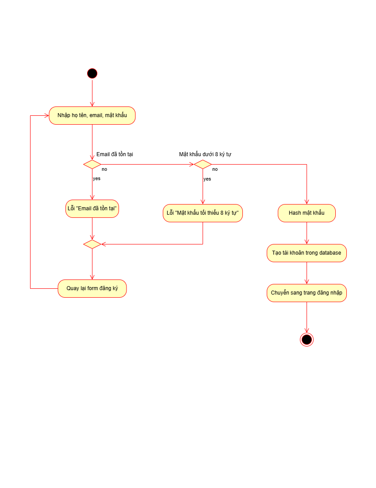

### 4.2. Đăng nhập hệ thống (Login)
> Biểu diễn quy trình xác thực người dùng, bảo mật thông tin đăng nhập sai, cấp phát JWT token và điều hướng vào trang Dashboard.

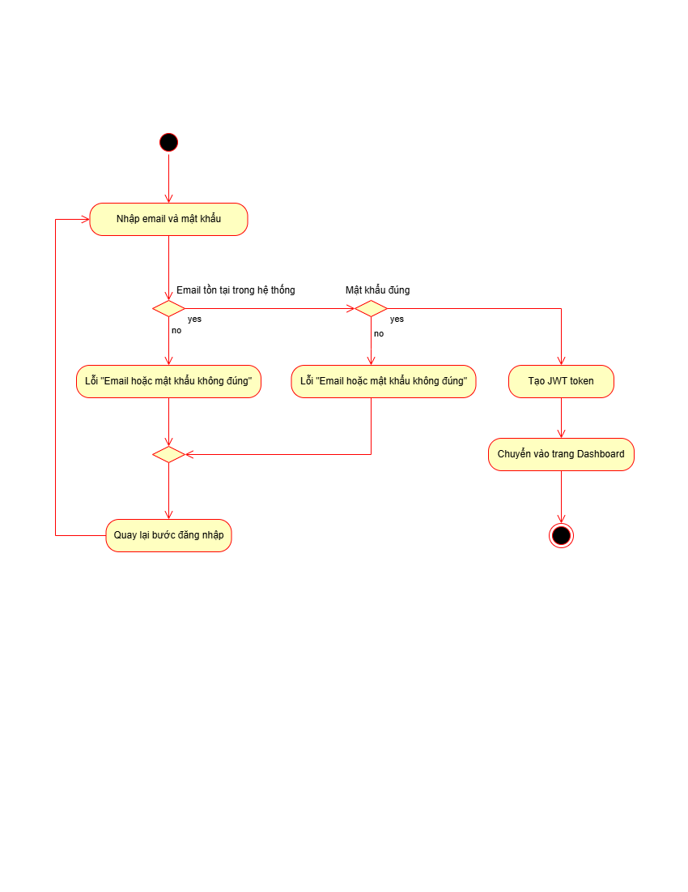

### 4.3. Vòng đời dữ liệu (Object Lifecycle)
> Biểu diễn vòng đời 3 trạng thái của Object (`Active` <-> `Archived` -> `Trash` -> `Permanent Delete`), cơ chế khôi phục (Restore) và dọn dẹp liên kết khi xóa vĩnh viễn.

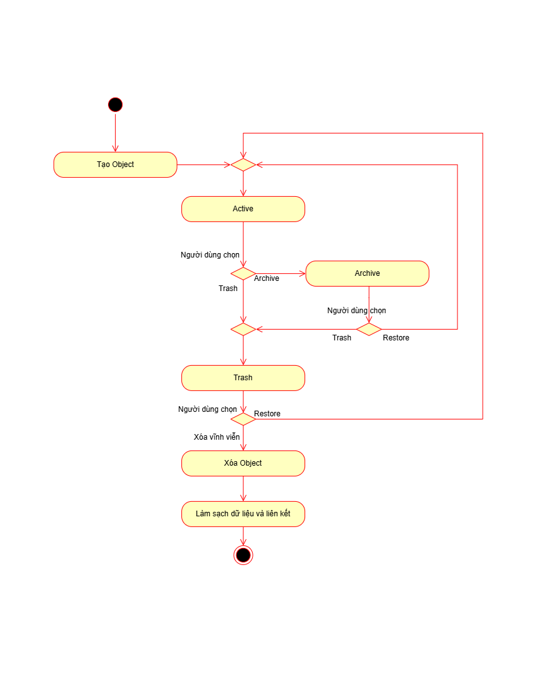

### 4.4. Tạo Task và Tự động đặt vào Space (Create Task & Placement)
> Biểu diễn tương tác đa làn (Swimlane) giữa Người dùng và Hệ thống: Xác thực dữ liệu đầu vào (tiêu đề, hạn chót) và tự động tạo bản ghi vị trí `SpaceObject` nếu thao tác trong một Space cụ thể.

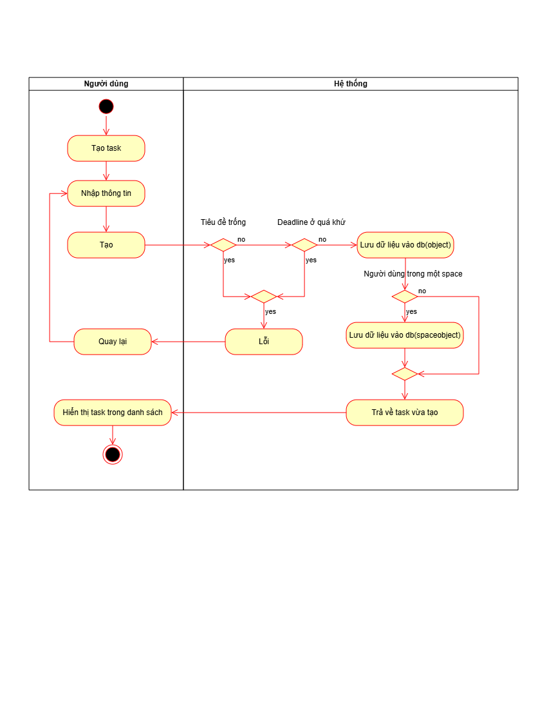

### 4.5. Phân biệt Gỡ khỏi Space vs Xóa Object (Remove from Space vs Delete)
> Biểu diễn điểm khác biệt cốt lõi của Kiến trúc Lần 3: Thao tác "Gỡ khỏi Space" chỉ xóa liên kết vị trí `SpaceObject` (dữ liệu gốc vẫn tồn tại an toàn), còn "Chuyển vào Trash" đánh dấu xóa mềm trên Object (`deletedAt = now()`).

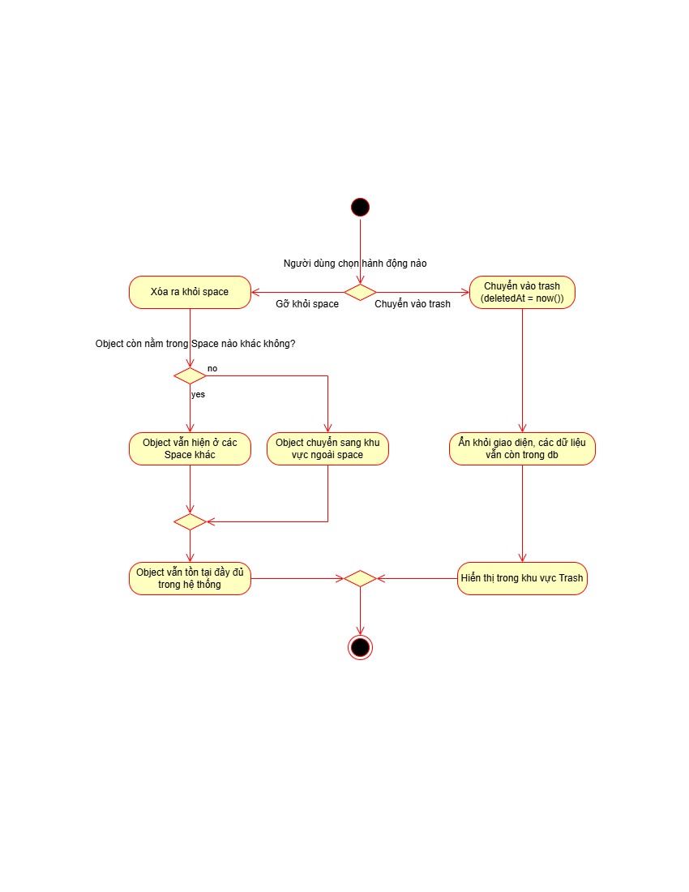

### 4.6. Hệ thống tạo thông báo tự động (Automatic Notification)
> Biểu diễn cơ chế quét định kỳ nền (Background Job) tìm các Task/Event sắp tới hạn, cơ chế chống tạo thông báo trùng lặp, lưu trữ vào DB và đồng bộ trạng thái đã đọc với Người dùng.

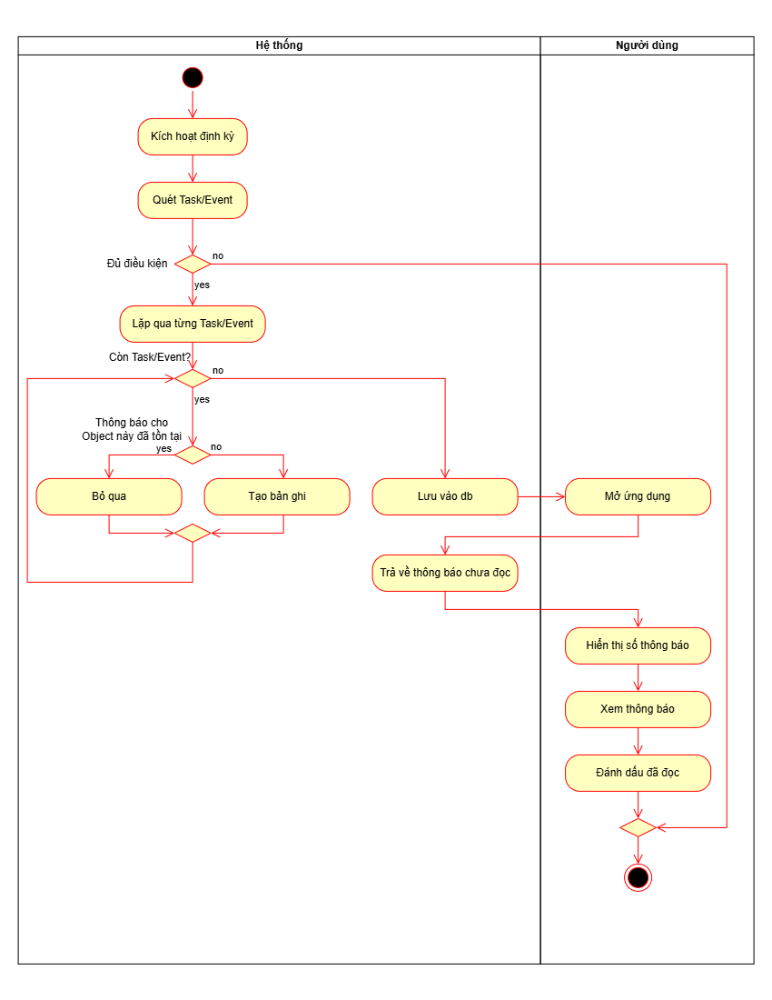

---

## 5. Feature Matrix (Ma trận Chức năng)

> Bảng chéo kiểm tra: Module nào có chức năng gì — đảm bảo không bỏ sót khi code.

| Chức năng                  | Auth | Space | Task | Note | Event | Reference | Placement | Relation | View | Dashboard | Notification |
| -------------------------- |:----:|:-----:|:----:|:----:|:-----:|:---------:|:---------:|:--------:|:----:|:---------:|:------------:|
| Tạo mới                    | x    | x     | x    | x    | x     | x         | x          | x        |      |           |              |
| Xem danh sách              |      | x     | x    | x    | x     | x         | x          | x        | x    | x         | x            |
| Xem chi tiết               |      | x     | x    | x    | x     | x         |            |          |      |           |              |
| Cập nhật                   | x    | x     | x    | x    | x     | x         |            |          |      |           |              |
| Xóa / Permanent Delete     |      | x     | x    | x    | x     | x         |            | x        |      |           | x            |
| Gắn vào nhiều Space       |      |       | x    | x    | x     | x         | x          |          |      |           |              |
| Gỡ khỏi Space (không xóa) |      |       | x    | x    | x     | x         | x          |          |      |           |              |
| Archive / Restore          |      |       | x    | x    | x     | x         |            |          |      |           |              |
| Trash / Restore            |      |       | x    | x    | x     | x         |            |          |      |           |              |
| Gắn Tag                    |      |       | x    | x    |       | x         |            |          |      |           |              |
| Liên kết với nội dung khác |      |       | x    | x    | x     | x         |            | x        |      |           |              |
| Nhắc nhở deadline          |      |       | x    |      | x     |           |            |          |      | x         | x            |
| Hiển thị theo thời gian    |      |       | x    |      | x     |           |            |          | x    |           |              |

---

*Tiếp theo: [04_System_Architecture.md](04_System_Architecture.md) (song song với [05_Domain_Model.md](05_Domain_Model.md))*
*Quay lại mục lục: [docs/README.md](README.md)*
