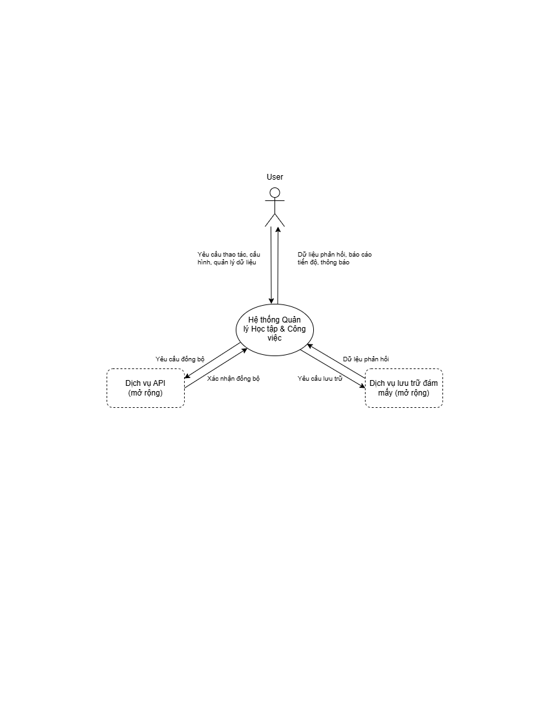
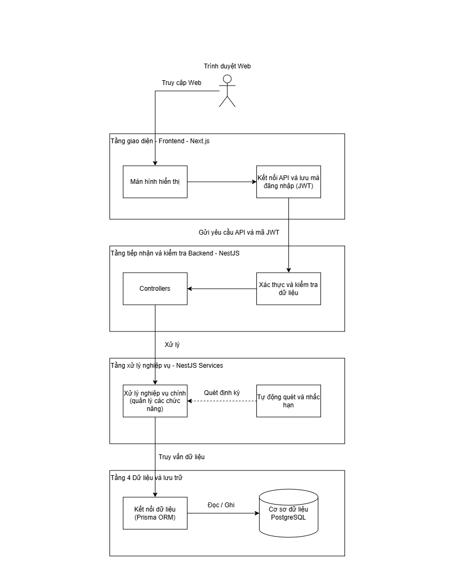

# 04_System_Architecture.md — Kiến trúc hệ thống

> Tài liệu trước: [03_Functional_Analysis.md](03_Functional_Analysis.md)
> Tài liệu sau: [05_Domain_Model.md](05_Domain_Model.md) và  [06_Database_Design.md](06_Database_Design.md)

---

## 1. Context Diagram (Sơ đồ ngữ cảnh)

> Hệ thống kết nối với ai/cái gì bên ngoài? Xác định ranh giới hệ thống (System Boundary).

```
Sơ đồ: ../diagrams/04_Context_Diagram.drawio
Export: ../diagrams/exports/04_Context_Diagram.png
```



**Actors bên ngoài:**
- **User (Người dùng cuối):** Học sinh, sinh viên, người đi làm. Tương tác qua trình duyệt web trên máy tính hoặc thiết bị di động.
  - Gửi yêu cầu: Đăng ký/đăng nhập, thao tác dữ liệu (Task, Note, Event, Reference), cấu hình Space, thiết lập liên kết (Relation).
  - Nhận phản hồi: Giao diện trực quan hóa, danh sách công việc, thông báo nhắc hạn và số liệu thống kê Dashboard.
- **Biên giới hệ thống (System Boundary):**
  - Hệ thống vận hành độc lập (Self-contained).
  - Giai đoạn MVP chưa tích hợp trực tiếp với các dịch vụ bên ngoài (như Google Calendar, Google Drive Sync) nhằm tập trung tối đa cho tính ổn định của mô hình dữ liệu lõi.

---

## 2. High-Level Architecture

> Hệ thống được tổ chức thành các tầng nào và luồng dữ liệu chính di chuyển ra sao?

```
Sơ đồ: ../diagrams/04_System_Architecture.drawio
Export: ../diagrams/exports/04_System_Architecture.png
```



**Mô tả luồng chính:**
- **Trình duyệt Web (Client):** Người dùng tương tác qua giao diện web.
- **Next.js (Frontend):** Phục vụ giao diện người dùng, quản lý routing (App Router) và gửi yêu cầu REST API (kèm JWT).
- **NestJS (Backend):** Tiếp nhận API, kiểm tra xác thực (Guard), validate dữ liệu (Pipe), xử lý logic nghiệp vụ phân tầng (Service) và chạy tác vụ ngầm quét hạn (Scheduler).
- **Prisma ORM:** Lớp truy cập dữ liệu trung gian, thực thi truy vấn Type-safe và quản lý giao dịch ACID.
- **PostgreSQL (Database):** Lưu trữ toàn bộ dữ liệu quan hệ của hệ thống.

**Giải thích phân tầng:**
1. **Presentation Layer (Next.js):** App Router, React Components, Tailwind/CSS, Axios Client, State Management.
2. **API & Controller Layer (NestJS):** REST Controllers, JwtAuthGuard, ValidationPipe, Global Exception Filter.
3. **Domain & Business Layer (NestJS Services):** Thực thi toàn bộ quy tắc nghiệp vụ Kiến trúc Lần 3 (Object, Space, Placement, Relation, View, Notification).
4. **Data Access & Persistence Layer (Prisma ORM & PostgreSQL):** Đảm bảo toàn vẹn dữ liệu, quan hệ khóa ngoại và tối ưu hóa chỉ mục B-Tree.

---

## 3. Danh sách Module & Dependency

> Phân rã backend theo mô hình Lần 3 và quan hệ phụ thuộc giữa các module.

| Module | Trách nhiệm | Phụ thuộc vào |
|---|---|---|
| **AuthModule** | Đăng ký, đăng nhập, mã hóa bcrypt, cấp phát và xác thực JWT token | PrismaModule |
| **SpaceModule** | Quản lý không gian làm việc (CRUD Space, màu sắc, icon, phân cấp cha/con) | PrismaModule, AuthModule |
| **ObjectModule** | **Hạt nhân lõi:** Vòng đời (Active / Archived / Trash) và thuộc tính chung của `Task`, `Note`, `Event`, `Reference` | PrismaModule, AuthModule |
| **PlacementModule** | Quản lý vị trí `SpaceObject` (gán Object vào Space, gỡ khỏi Space, phân loại Unassigned) | ObjectModule, SpaceModule |
| **RelationModule** | Quản lý liên kết chéo động n-n giữa 2 Object bất kỳ (`ObjectRelation`) | ObjectModule |
| **ViewDashboardModule** | Cung cấp API lọc và tổng hợp dữ liệu phục vụ các View (Kanban, Calendar, Timeline) và Dashboard | ObjectModule, SpaceModule, PlacementModule |
| **NotificationModule** | Quản lý thông báo người dùng, cron job chạy ngầm định kỳ quét deadline Task/Event | ObjectModule, PrismaModule |
| **PrismaModule** | Khởi tạo và chia sẻ kết nối `PrismaClient` toàn cục (Global Module) | — |

**Quan hệ phụ thuộc:**
- `PrismaModule` là global module được chia sẻ cho toàn bộ ứng dụng.
- `AuthModule` cung cấp guard bảo vệ cho tất cả các module nghiệp vụ.
- `ObjectModule` đóng vai trò hạt nhân trung tâm, `PlacementModule` và `RelationModule` phụ thuộc trực tiếp vào `ObjectModule`.
- `ViewDashboardModule` tổng hợp dữ liệu từ `ObjectModule`, `SpaceModule` và `PlacementModule`.

---

## 4. Decision Log (Lý do chọn công nghệ)

> Mục này quan trọng khi bảo vệ đồ án — hội đồng hay hỏi "Tại sao em chọn X mà không chọn Y?"

| Quyết định | Lựa chọn | Thay thế đã xem xét | Lý do |
|---|---|---|---|
| **Mô hình Dữ liệu Lõi** | **Hybrid Object Model (Lần 3)** | Chia bảng rời rạc (Lần 1) / Space chứa Item cứng (Lần 2) | Giải quyết triệt để bài toán: Một nội dung vừa là học tập vừa là công việc; một Object có thể nằm ở nhiều Space hoặc đứng độc lập; liên kết chéo tự do không phá vỡ quan hệ. |
| **Database** | **PostgreSQL** | MongoDB, MySQL | Dữ liệu có tính liên kết quan hệ chặt chẽ (Object ↔ SpaceObject ↔ Relation). PostgreSQL vượt trội ở tính ACID, hỗ trợ JSONB cho metadata và độ ổn định cao. |
| **ORM** | **Prisma** | TypeORM, Sequelize | Type-safe 100% từ Database Schema tới TypeScript Client, migration tường minh, schema dễ đọc, cú pháp query ngắn gọn và ít lỗi runtime hơn TypeORM. |
| **Backend framework** | **NestJS** | Express.js thuần, Fastify | Cấu trúc module chuẩn mực, tích hợp sẵn Dependency Injection (IoC), Guards, Pipes, Filters. Phù hợp phát triển hệ thống nhiều module liên kết chặt chẽ. |
| **Frontend framework** | **Next.js (App Router)** | Create React App, Vite SPA | App Router cung cấp layout lồng nhau tối ưu cho giao diện có sidebar cố định, hỗ trợ tối ưu hóa routing và bảo vệ phân quyền ở tầng middleware. |
| **Authentication** | **JWT (stateless)** | Session-based (Cookie/Redis) | Phù hợp với kiến trúc REST API decoupled. Server không cần duy trì session trong bộ nhớ, đơn giản hóa việc scale và kiểm thử. |
| **Background Job** | **@nestjs/schedule (Cron)** | BullMQ + Redis, RabbitMQ | Đồ án phục vụ người dùng cá nhân (MVP), cron job in-process của NestJS đủ đáp ứng nhu cầu quét deadline định kỳ mà không cần cài đặt thêm hạ tầng Redis phức tạp. |

---

## 5. Cấu trúc thư mục Backend (dự kiến)

```
backend/src/
├── common/                    # Dùng chung toàn ứng dụng
│   ├── decorators/            # @CurrentUser, @Public
│   ├── filters/               # Global Exception Filter
│   ├── guards/                # JwtAuthGuard
│   ├── interceptors/          # Logging & Response Transform
│   └── utils/                 # Hashing, Helper functions
├── modules/
│   ├── auth/                  # Module Xác thực (Controller, Service, DTO, JwtStrategy)
│   ├── space/                 # Module Không gian làm việc
│   ├── object/                # HẠT NHÂN LÕI: Object CRUD & Lifecycle
│   ├── placement/             # Quản lý gán/gỡ SpaceObject
│   ├── relation/              # Liên kết chéo ObjectRelation
│   ├── view/                  # API tổng hợp Kanban, Calendar, Dashboard
│   └── notification/          # Thông báo & Scheduler Cron Job
├── prisma/
│   ├── prisma.service.ts      # Kết nối PrismaClient Lifecycle
│   └── prisma.module.ts
├── app.module.ts              # Root Module
└── main.ts                    # Entrypoint khởi tạo ứng dụng
```

---

## 6. Cấu trúc thư mục Frontend (dự kiến)

```
frontend/src/
├── app/                       # Next.js App Router
│   ├── (auth)/                # Route Group xác thực (login, register)
│   │   ├── login/page.tsx
│   │   └── register/page.tsx
│   ├── (dashboard)/           # Route Group chính (có Sidebar & Header)
│   │   ├── layout.tsx         # Layout chung: Sidebar cố định + Header
│   │   ├── page.tsx           # Trang Dashboard tổng quan
│   │   ├── spaces/[id]/       # Chi tiết Space
│   │   ├── views/             # Các góc nhìn: kanban, calendar, timeline
│   │   ├── unassigned/        # Danh mục Object ngoài Space
│   │   ├── archive/           # Kho lưu trữ
│   │   └── trash/             # Thùng rác
│   ├── globals.css
│   └── layout.tsx             # Root Layout
├── components/
│   ├── common/                # UI cơ bản: Button, Input, Modal, Badge
│   ├── layout/                # Sidebar, Header, NotificationBell
│   └── features/              # UI nghiệp vụ: ObjectCard, SpaceTree, RelationPicker
├── hooks/                     # Custom Hooks: useAuth, useObjects, useSpaces
├── lib/                       # Cấu hình Axios client, utilities
├── services/                  # API Client calls tương ứng Backend
└── types/                     # TypeScript Interfaces & Enums
```

---

## 7. Chiến lược Phi chức năng & Bảo mật

- **Bảo mật mật khẩu:** Băm một chiều bằng **Bcrypt** với salt round = 10, không bao giờ lưu mật khẩu dạng plain text.
- **Xác thực JWT:** Token ký với khóa bí mật `JWT_SECRET`, gắn kèm header `Authorization: Bearer <token>` trên mọi private endpoint.
- **Phân tách dữ liệu (Data Isolation):** Mọi câu lệnh truy vấn/thao tác tại Service đều bắt buộc ràng buộc `userId = req.user.id`, loại trừ triệt để nguy cơ truy cập chéo trái phép (IDOR).
- **Sanitization:** Sử dụng `ValidationPipe` với `whitelist: true` để tự động loại bỏ các trường không khai báo trong DTO, chống tấn công Mass Assignment.
- **Toàn vẹn giao dịch:** Dùng `prisma.$transaction()` cho các hành vi phức tạp như Xóa vĩnh viễn (Cascade delete `SpaceObject` và `ObjectRelation` cùng lúc với `Object`).
- **Xóa mềm (Soft Delete):** Đánh dấu `deletedAt = now()` khi đưa Object vào Trash, giữ nguyên vẹn liên kết vị trí và quan hệ để sẵn sàng Restore.
- **Tối ưu chỉ mục (Indexing):** Đánh chỉ mục B-Tree trên các cột thường xuyên lọc: `email`, `(userId, lifecycle)`, `(userId, type)`, `dueDate`, `(spaceId, position)`.

---

*Tiếp theo: [05_Domain_Model.md](05_Domain_Model.md)*  
*Quay lại mục lục: [docs/README.md](README.md)*
