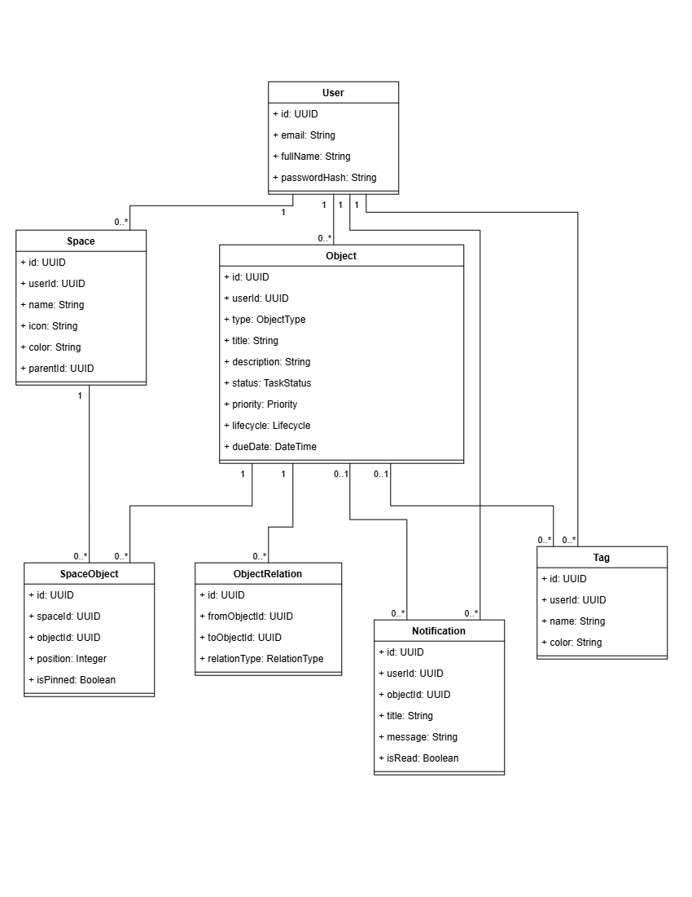

# 05_Domain_Model.md — Mô hình nghiệp vụ

> Tài liệu trước: [03_Functional_Analysis.md](03_Functional_Analysis.md) và [04_System_Architecture.md](04_System_Architecture.md)
> Tài liệu sau: [06_Database_Design.md](06_Database_Design.md)

---

## 1. Danh sách Domain Entities

> Mô tả từng thực thể nghiệp vụ. Chỉ tập trung vào ý nghĩa nghiệp vụ, không ghi kiểu dữ liệu kỹ thuật ở đây.

### User (Người dùng)
- Đại diện cho chủ sở hữu tài khoản cá nhân.
- Thuộc tính: email, mật khẩu, họ tên, ảnh đại diện.
- Là "chủ sở hữu" của tất cả dữ liệu khác — không có dữ liệu nào không thuộc về một User cụ thể.

### Space (Không gian làm việc)
- Là ngữ cảnh (Container / Context) do người dùng tự định nghĩa để gom nhóm công việc theo chủ đề (ví dụ: *Học kỳ 1*, *Đồ án tốt nghiệp*, *Việc Freelance*).
- Thuộc tính: tên không gian, mô tả, biểu tượng (icon), màu sắc nhận diện, không gian cha (hỗ trợ phân cấp cây).
- **Đặc tính cốt lõi (Lần 3):** Space không sở hữu độc quyền Object. Space chỉ đóng vai trò "gắn nhãn vị trí". Một nội dung có thể xuất hiện ở nhiều Space hoặc không thuộc Space nào.

### Object (Hạt nhân Dữ liệu Đa hình)
- Đại diện cho mọi nội dung dữ liệu của người dùng trong hệ thống.
- Được phân loại qua thuộc tính `type`:
  - `TASK`: Công việc cần làm (có trạng thái hoàn thành, hạn chót, độ ưu tiên).
  - `NOTE`: Ghi chú, biên bản, tài liệu tổng hợp dạng văn bản/markdown.
  - `EVENT`: Sự kiện, lịch hẹn có mốc thời gian bắt đầu và kết thúc cụ thể.
  - `REFERENCE`: Tài liệu tham khảo, đường dẫn web, tài liệu học tập.
- Thuộc tính nghiệp vụ chung: tiêu đề, mô tả chi tiết, độ ưu tiên, trạng thái vòng đời (Active/Archived/Trash), thuộc tính riêng theo loại (dueDate, startAt, endAt, url, metadata).

### SpaceObject (Vị trí gán trong Space)
- Đại diện cho quan hệ vị trí của một Object bên trong một Space cụ thể.
- Thuộc tính: thứ tự sắp xếp trong Space (position), đánh dấu ghim lên đầu (isPinned), thời điểm đưa vào Space.
- Giải quyết bài toán N-M: Cho phép một Object xuất hiện đồng thời trong nhiều Space, và khi gỡ khỏi một Space thì dữ liệu gốc vẫn an toàn.

### ObjectRelation (Liên kết chéo động)
- Đại diện cho mối liên kết tự do hai chiều hoặc có hướng giữa bất kỳ 2 Object nào trong hệ thống.
- Thuộc tính: Object nguồn, Object đích, bản chất liên kết (`RELATES_TO`, `DEPENDS_ON`, `REFERENCES`, `PARENT_OF`), thời điểm tạo.
- Giúp người dùng liên kết không giới hạn (Task liên kết Note, Note liên kết Reference, Event liên kết Task).

### Tag (Thẻ phân loại ngang)
- Thẻ đánh dấu dùng để phân loại và lọc nhanh dữ liệu ngang hàng giữa các Space.
- Thuộc tính: tên thẻ, màu sắc nhận diện.

### Notification (Thông báo hệ thống)
- Bản ghi nhắc nhở được hệ thống sinh tự động khi Task/Event sắp tới hạn.
- Thuộc tính: tiêu đề cảnh báo, nội dung nhắc việc, đối tượng liên quan, trạng thái đã đọc/chưa đọc.

---

## 2. Quan hệ giữa các Entities (Domain Relations)

> Mô tả các mối liên hệ nghiệp vụ giữa các thực thể.

- `User ──< Space` : Một người dùng sở hữu nhiều Space.
- `User ──< Object` : Mọi Object đều thuộc về một User duy nhất.
- `User ──< Tag` : Tag do người dùng tự định nghĩa.
- `Space >──< Object` : Quan hệ Nhiều - Nhiều thông qua thực thể trung gian `SpaceObject`.
- `Object >──< Object` : Quan hệ liên kết chéo tự do thông qua `ObjectRelation`.
- `Object ──< Notification` : Một Object có thể sinh ra các thông báo nhắc việc.
- `Object >──< Tag` : Một Object có thể gắn nhiều Tag và một Tag áp dụng cho nhiều Object.

### Sơ đồ Domain Model

```
Sơ đồ: ../diagrams/05_Domain.drawio
Export: ../diagrams/exports/05_Domain_Model.png
```



---

## 3. Vòng đời & Trạng thái (Lifecycle & Status)

### 3.1. Vòng đời Object (Object Lifecycle)

Hệ thống kiểm soát 3 trạng thái vòng đời nhất quán cho mọi loại Object:

- **ACTIVE (Đang hoạt động):** Trạng thái mặc định khi tạo mới. Hiển thị bình thường trong các Space được gán và các góc nhìn (Kanban, Calendar, Timeline).
- **ARCHIVED (Lưu trữ):** Dành cho dữ liệu của các dự án/môn học đã hoàn tất nhưng cần giữ lại tra cứu. Bị ẩn khỏi màn hình làm việc thường nhật, không kích hoạt thông báo, nhưng vẫn bảo toàn đầy đủ các vị trí trong Space và các mối liên kết `ObjectRelation`.
- **TRASH (Thùng rác):** Đánh dấu xóa mềm (`deletedAt = now()`). Bị ẩn khỏi toàn bộ giao diện làm việc. Vị trí trong Space và liên kết vẫn lưu giữ để sẵn sàng khôi phục (`RESTORE`).
- **HARD DELETE (Xóa vĩnh viễn):** Chỉ thực hiện khi người dùng chủ động xóa từ Thùng rác. Cascade dọn dẹp sạch toàn bộ bản ghi Object, liên kết vị trí `SpaceObject` và liên kết `ObjectRelation`.

### 3.2. Trạng thái Công việc (Task Status)

Áp dụng cho Object loại `TASK`:

| Status | Ý nghĩa nghiệp vụ |
|---|---|
| `TODO` | Việc cần làm, chưa bắt đầu |
| `IN_PROGRESS` | Đang trong quá trình thực hiện |
| `DONE` | Đã hoàn thành |
| `CANCELLED` | Đã hủy bỏ (không tiếp tục làm) |

### 3.3. Độ ưu tiên (Priority)

Áp dụng cho `TASK` và `EVENT`:
- `LOW`: Mức ưu tiên thấp.
- `MEDIUM`: Mức ưu tiên trung bình (mặc định).
- `HIGH`: Mức ưu tiên cao.
- `URGENT`: Khẩn cấp, cần giải quyết ngay.

### 3.4. Bản chất quan hệ liên kết (Relation Types)

Áp dụng cho `ObjectRelation`:
- `RELATES_TO`: Liên quan nội dung tổng quát.
- `DEPENDS_ON`: Phụ thuộc tiến độ (Task A cần hoàn thành trước Task B).
- `REFERENCES`: Tham chiếu nguồn tài liệu (Task tham chiếu Note/Reference).
- `PARENT_OF`: Quan hệ cấu trúc mục lớn / mục con.

---

## 4. Quy tắc Nghiệp vụ Cốt lõi (Business Invariants)

1. **Gỡ khỏi Space không làm mất dữ liệu gốc:**
   - Thao tác "Gỡ khỏi Space" chỉ xóa bản ghi vị trí `SpaceObject` tại Space hiện tại.
   - Nếu Object không còn nằm trong Space nào khác, Object tự động chuyển vào danh mục **Unassigned (Ngoài Space)**. Object hoàn toàn không bị xóa khỏi hệ thống.
2. **Một nội dung — Nhiều ngữ cảnh:**
   - Một Object có thể được đặt vào nhiều Space cùng lúc. Dữ liệu nội dung (tiêu đề, tiến độ, trạng thái) đồng bộ tức thì trên tất cả các Space chứa nó.
3. **Toàn vẹn liên kết:**
   - Không cho phép Object tự liên kết với chính nó.
   - Không cho phép tạo 2 liên kết trùng loại cùng chiều giữa 2 Object.
4. **Nhắc nhở thông minh:**
   - Chỉ tạo thông báo cho Object ở trạng thái `ACTIVE` và chưa `DONE`.
   - Chống spam: Không tạo thông báo lặp lại cho cùng một mốc hạn chót nếu người dùng chưa xử lý thông báo trước đó.

---

*Tiếp theo: [06_Database_Design.md](06_Database_Design.md)*  
*Quay lại mục lục: [docs/README.md](README.md)*
