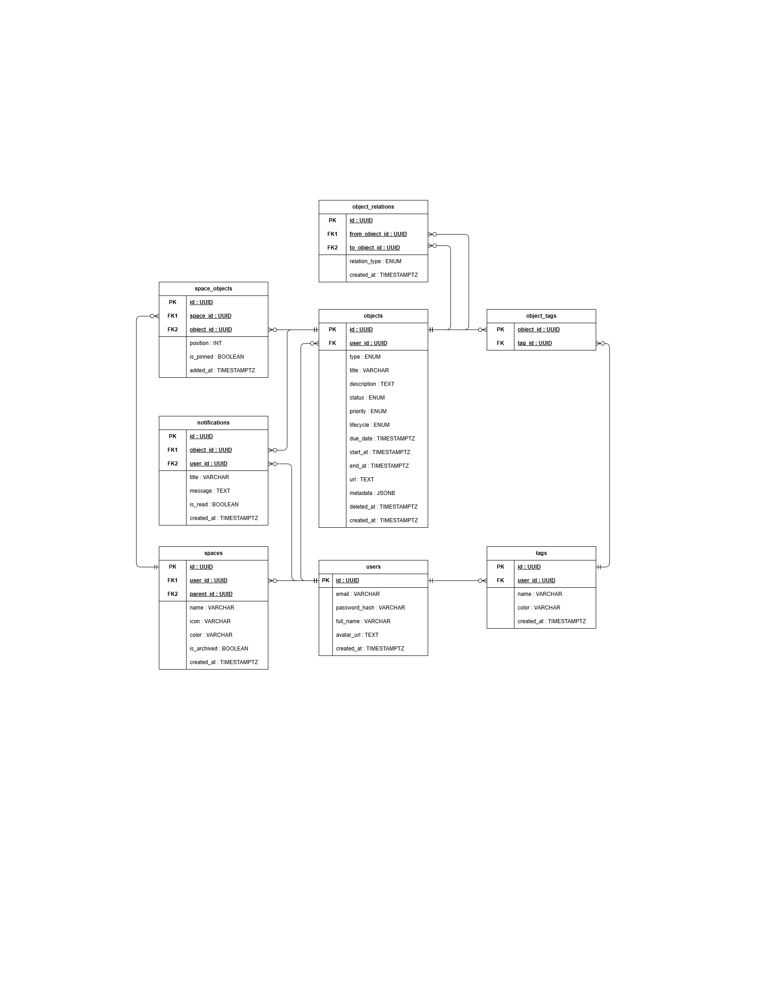

# 06_Database_Design.md — Thiết kế cơ sở dữ liệu

> Tài liệu trước: [04_System_Architecture.md](04_System_Architecture.md) và [05_Domain_Model.md](05_Domain_Model.md)
> Tài liệu sau: [07_API_Design.md](07_API_Design.md)

---


## 1. ERD mức Logic

> Ánh xạ từ Domain Model sang các bảng database. Tập trung vào quan hệ giữa bảng, chưa chi tiết kiểu dữ liệu.

```
Sơ đồ: ../diagrams/06_ERD.drawio
Export: ../diagrams/exports/06_ERD.png
```



---

## 2. ERD mức Physical

> Sinh tự động từ Prisma bằng `prisma-erd-generator` sau khi có `schema.prisma`.

```bash
# Cài đặt công cụ tự sinh ERD từ Prisma
npm install -D prisma-erd-generator @mermaid-js/mermaid-cli

# Cấu hình generator trong schema.prisma:
# generator erd {
#   provider = "prisma-erd-generator"
#   output   = "ERD.svg"
# }

# Chạy sinh sơ đồ vật lý
npx prisma generate
```


---

## 3. Data Dictionary (Từ điển dữ liệu)

> Mỗi field đều phải có ý nghĩa rõ ràng. Đây là mục hội đồng thường hỏi.

### Bảng: `users`
Lưu trữ thông tin tài khoản người dùng cá nhân.

| Column | Kiểu dữ liệu | Nullable | Default | Ý nghĩa |
|---|---|---|---|---|
| `id` | UUID | NO | gen_random_uuid() | Khóa chính |
| `email` | VARCHAR(255) | NO | — | Email đăng nhập, UNIQUE |
| `password_hash` | VARCHAR(255) | NO | — | Mật khẩu đã hash (Bcrypt) |
| `full_name` | VARCHAR(100) | NO | — | Họ và tên hiển thị |
| `avatar_url` | TEXT | YES | NULL | Đường dẫn ảnh đại diện |
| `created_at` | TIMESTAMPTZ | NO | NOW() | Thời điểm tạo tài khoản |
| `updated_at` | TIMESTAMPTZ | NO | NOW() | Thời điểm cập nhật gần nhất |

---

### Bảng: `spaces`
Không gian làm việc quản lý theo chủ đề của người dùng.

| Column | Kiểu dữ liệu | Nullable | Default | Ý nghĩa |
|---|---|---|---|---|
| `id` | UUID | NO | gen_random_uuid() | Khóa chính |
| `user_id` | UUID | NO | — | FK → users.id (CASCADE) |
| `name` | VARCHAR(100) | NO | — | Tên không gian |
| `description` | TEXT | YES | NULL | Mô tả mục đích không gian |
| `icon` | VARCHAR(50) | NO | `'📁'` | Biểu tượng emoji / icon |
| `color` | VARCHAR(20) | NO | `'#6366f1'` | Mã màu nhận diện Hex |
| `parent_id` | UUID | YES | NULL | FK → spaces.id (SET NULL, cây phân cấp) |
| `is_archived` | BOOLEAN | NO | false | Đã lưu trữ hay chưa |
| `created_at` | TIMESTAMPTZ | NO | NOW() | Thời điểm tạo |
| `updated_at` | TIMESTAMPTZ | NO | NOW() | Thời điểm cập nhật |

---

### Bảng: `objects` (Hạt nhân Dữ liệu Đa hình)
Bảng trung tâm lưu trữ toàn bộ Task, Note, Event, Reference.

| Column | Kiểu dữ liệu | Nullable | Default | Ý nghĩa |
|---|---|---|---|---|
| `id` | UUID | NO | gen_random_uuid() | Khóa chính |
| `user_id` | UUID | NO | — | FK → users.id (CASCADE) |
| `type` | ENUM | NO | — | TASK / NOTE / EVENT / REFERENCE |
| `title` | VARCHAR(255) | NO | — | Tiêu đề nội dung |
| `description` | TEXT | YES | NULL | Nội dung chi tiết hoặc ghi chú markdown |
| `status` | ENUM | NO | `TODO` | TODO / IN_PROGRESS / DONE / CANCELLED |
| `priority` | ENUM | NO | `MEDIUM` | LOW / MEDIUM / HIGH / URGENT |
| `lifecycle` | ENUM | NO | `ACTIVE` | ACTIVE / ARCHIVED / TRASH |
| `due_date` | TIMESTAMPTZ | YES | NULL | Hạn chót hoàn thành (cho TASK) |
| `start_at` | TIMESTAMPTZ | YES | NULL | Mốc bắt đầu (cho EVENT) |
| `end_at` | TIMESTAMPTZ | YES | NULL | Mốc kết thúc (cho EVENT) |
| `url` | TEXT | YES | NULL | Đường dẫn tham chiếu (cho REFERENCE) |
| `metadata` | JSONB | NO | `'{}'` | Dữ liệu cấu hình mở rộng động |
| `deleted_at` | TIMESTAMPTZ | YES | NULL | Mốc xóa mềm vào Trash |
| `created_at` | TIMESTAMPTZ | NO | NOW() | Thời điểm tạo |
| `updated_at` | TIMESTAMPTZ | NO | NOW() | Thời điểm cập nhật |

---

### Bảng: `space_objects` (Vị trí gán Object vào Space)
Quản lý quan hệ nhiều - nhiều giữa Space và Object.

| Column | Kiểu dữ liệu | Nullable | Default | Ý nghĩa |
|---|---|---|---|---|
| `id` | UUID | NO | gen_random_uuid() | Khóa chính |
| `space_id` | UUID | NO | — | FK → spaces.id (CASCADE) |
| `object_id` | UUID | NO | — | FK → objects.id (CASCADE) |
| `position` | INTEGER | NO | 0 | Thứ tự sắp xếp trong Space |
| `is_pinned` | BOOLEAN | NO | false | Đánh dấu ghim lên đầu Space |
| `added_at` | TIMESTAMPTZ | NO | NOW() | Thời điểm gán vào Space |

*(Ràng buộc duy nhất: `UNIQUE (space_id, object_id)` — Ngăn gán trùng 1 Object vào cùng 1 Space).*

---

### Bảng: `object_relations` (Liên kết Chéo giữa các Object)
Quản lý liên kết động tự do giữa 2 Object bất kỳ.

| Column | Kiểu dữ liệu | Nullable | Default | Ý nghĩa |
|---|---|---|---|---|
| `id` | UUID | NO | gen_random_uuid() | Khóa chính |
| `from_object_id` | UUID | NO | — | FK → objects.id (CASCADE) |
| `to_object_id` | UUID | NO | — | FK → objects.id (CASCADE) |
| `relation_type` | ENUM | NO | `RELATES_TO` | RELATES_TO / DEPENDS_ON / REFERENCES / PARENT_OF |
| `created_at` | TIMESTAMPTZ | NO | NOW() | Thời điểm tạo liên kết |

*(Ràng buộc duy nhất: `UNIQUE (from_object_id, to_object_id, relation_type)`, `CHECK (from_object_id <> to_object_id)`).*

---

### Bảng: `tags`
Thẻ phân loại dữ liệu ngang hàng giữa các Space.

| Column | Kiểu dữ liệu | Nullable | Default | Ý nghĩa |
|---|---|---|---|---|
| `id` | UUID | NO | gen_random_uuid() | Khóa chính |
| `user_id` | UUID | NO | — | FK → users.id (CASCADE) |
| `name` | VARCHAR(50) | NO | — | Tên tag, UNIQUE trên từng User |
| `color` | VARCHAR(20) | NO | `'#94a3b8'` | Màu hex hiển thị |
| `created_at` | TIMESTAMPTZ | NO | NOW() | Thời điểm tạo |

---

### Bảng: `object_tags` (Bảng trung gian Object ↔ Tag)

| Column | Kiểu dữ liệu | Nullable | Default | Ý nghĩa |
|---|---|---|---|---|
| `object_id` | UUID | NO | — | FK → objects.id (CASCADE) |
| `tag_id` | UUID | NO | — | FK → tags.id (CASCADE) |

*(Khóa chính tổng hợp: `PRIMARY KEY (object_id, tag_id)`).*

---

### Bảng: `notifications`
Thông báo nhắc việc hệ thống sinh tự động.

| Column | Kiểu dữ liệu | Nullable | Default | Ý nghĩa |
|---|---|---|---|---|
| `id` | UUID | NO | gen_random_uuid() | Khóa chính |
| `user_id` | UUID | NO | — | FK → users.id (CASCADE) |
| `object_id` | UUID | YES | NULL | FK → objects.id (CASCADE, Object liên quan) |
| `title` | VARCHAR(255) | NO | — | Tiêu đề thông báo |
| `message` | TEXT | NO | — | Nội dung chi tiết |
| `is_read` | BOOLEAN | NO | false | Đã đọc chưa |
| `read_at` | TIMESTAMPTZ | YES | NULL | Thời điểm đọc |
| `created_at` | TIMESTAMPTZ | NO | NOW() | Thời điểm sinh thông báo |

---

## 4. Prisma Schema (khung hoàn chỉnh)

> File cấu hình chính thức tại `../backend/prisma/schema.prisma`

```prisma
datasource db {
  provider = "postgresql"
  url      = env("DATABASE_URL")
}

generator client {
  provider = "prisma-client-js"
}

enum ObjectType {
  TASK
  NOTE
  EVENT
  REFERENCE
}

enum TaskStatus {
  TODO
  IN_PROGRESS
  DONE
  CANCELLED
}

enum Priority {
  LOW
  MEDIUM
  HIGH
  URGENT
}

enum ObjectLifecycle {
  ACTIVE
  ARCHIVED
  TRASH
}

enum RelationType {
  RELATES_TO
  DEPENDS_ON
  REFERENCES
  PARENT_OF
}

model User {
  id           String         @id @default(uuid()) @db.Uuid
  email        String         @unique @db.VarChar(255)
  passwordHash String         @map("password_hash") @db.VarChar(255)
  fullName     String         @map("full_name") @db.VarChar(100)
  avatarUrl    String?        @map("avatar_url")
  createdAt    DateTime       @default(now()) @map("created_at") @db.Timestamptz
  updatedAt    DateTime       @updatedAt @map("updated_at") @db.Timestamptz

  spaces        Space[]
  objects       Object[]
  tags          Tag[]
  notifications Notification[]

  @@map("users")
}

model Space {
  id          String    @id @default(uuid()) @db.Uuid
  userId      String    @map("user_id") @db.Uuid
  name        String    @db.VarChar(100)
  description String?
  icon        String    @default("📁") @db.VarChar(50)
  color       String    @default("#6366f1") @db.VarChar(20)
  parentId    String?   @map("parent_id") @db.Uuid
  isArchived  Boolean   @default(false) @map("is_archived")
  createdAt   DateTime  @default(now()) @map("created_at") @db.Timestamptz
  updatedAt   DateTime  @updatedAt @map("updated_at") @db.Timestamptz

  user         User          @relation(fields: [userId], references: [id], onDelete: Cascade)
  parent       Space?        @relation("SpaceHierarchy", fields: [parentId], references: [id], onDelete: SetNull)
  children     Space[]       @relation("SpaceHierarchy")
  spaceObjects SpaceObject[]

  @@map("spaces")
}

model Object {
  id          String          @id @default(uuid()) @db.Uuid
  userId      String          @map("user_id") @db.Uuid
  type        ObjectType
  title       String          @db.VarChar(255)
  description String?
  status      TaskStatus      @default(TODO)
  priority    Priority        @default(MEDIUM)
  lifecycle   ObjectLifecycle @default(ACTIVE)
  dueDate     DateTime?       @map("due_date") @db.Timestamptz
  startAt     DateTime?       @map("start_at") @db.Timestamptz
  endAt       DateTime?       @map("end_at") @db.Timestamptz
  url         String?
  metadata    Json            @default("{}")
  deletedAt   DateTime?       @map("deleted_at") @db.Timestamptz
  createdAt   DateTime        @default(now()) @map("created_at") @db.Timestamptz
  updatedAt   DateTime        @updatedAt @map("updated_at") @db.Timestamptz

  user          User             @relation(fields: [userId], references: [id], onDelete: Cascade)
  spaceObjects  SpaceObject[]
  outgoingRel   ObjectRelation[] @relation("OutgoingRelations")
  incomingRel   ObjectRelation[] @relation("IncomingRelations")
  objectTags    ObjectTag[]
  notifications Notification[]

  @@index([userId, lifecycle])
  @@index([userId, type])
  @@map("objects")
}

model SpaceObject {
  id        String   @id @default(uuid()) @db.Uuid
  spaceId   String   @map("space_id") @db.Uuid
  objectId  String   @map("object_id") @db.Uuid
  position  Int      @default(0)
  isPinned  Boolean  @default(false) @map("is_pinned")
  addedAt   DateTime @default(now()) @map("added_at") @db.Timestamptz

  space  Space  @relation(fields: [spaceId], references: [id], onDelete: Cascade)
  object Object @relation(fields: [objectId], references: [id], onDelete: Cascade)

  @@unique([spaceId, objectId])
  @@map("space_objects")
}

model ObjectRelation {
  id           String       @id @default(uuid()) @db.Uuid
  fromObjectId String       @map("from_object_id") @db.Uuid
  toObjectId   String       @map("to_object_id") @db.Uuid
  relationType RelationType @default(RELATES_TO) @map("relation_type")
  createdAt    DateTime     @default(now()) @map("created_at") @db.Timestamptz

  fromObject Object @relation("OutgoingRelations", fields: [fromObjectId], references: [id], onDelete: Cascade)
  toObject   Object @relation("IncomingRelations", fields: [toObjectId], references: [id], onDelete: Cascade)

  @@unique([fromObjectId, toObjectId, relationType])
  @@map("object_relations")
}

model Tag {
  id        String   @id @default(uuid()) @db.Uuid
  userId    String   @map("user_id") @db.Uuid
  name      String   @db.VarChar(50)
  color     String   @default("#94a3b8") @db.VarChar(20)
  createdAt DateTime @default(now()) @map("created_at") @db.Timestamptz

  user       User        @relation(fields: [userId], references: [id], onDelete: Cascade)
  objectTags ObjectTag[]

  @@unique([userId, name])
  @@map("tags")
}

model ObjectTag {
  objectId String @map("object_id") @db.Uuid
  tagId    String @map("tag_id") @db.Uuid

  object Object @relation(fields: [objectId], references: [id], onDelete: Cascade)
  tag    Tag    @relation(fields: [tagId], references: [id], onDelete: Cascade)

  @@id([objectId, tagId])
  @@map("object_tags")
}

model Notification {
  id        String    @id @default(uuid()) @db.Uuid
  userId    String    @map("user_id") @db.Uuid
  objectId  String?   @map("object_id") @db.Uuid
  title     String    @db.VarChar(255)
  message   String
  isRead    Boolean   @default(false) @map("is_read")
  readAt    DateTime? @map("read_at") @db.Timestamptz
  createdAt DateTime  @default(now()) @map("created_at") @db.Timestamptz

  user   User    @relation(fields: [userId], references: [id], onDelete: Cascade)
  object Object? @relation(fields: [objectId], references: [id], onDelete: Cascade)

  @@index([userId, isRead])
  @@map("notifications")
}
```

---

## 5. Indexing & Ràng buộc toàn vẹn

- **Chỉ mục B-Tree:**
  - `users(email)`: Đảm bảo kiểm tra đăng nhập siêu tốc.
  - `objects(user_id, lifecycle)`: Tối ưu lọc danh sách Active, Archived và Trash.
  - `objects(user_id, type)`: Tối ưu lọc theo loại (chỉ lấy Task hoặc Note...).
  - `space_objects(space_id, position)`: Tối ưu lấy danh sách đã sắp xếp trong Space.
  - `object_relations(from_object_id)`, `object_relations(to_object_id)`: Tối ưu duyệt đồ thị quan hệ 2 chiều.
- **Ràng buộc toàn vẹn:**
  - Xóa Space (`ON DELETE CASCADE` trên `space_objects`) chỉ xóa liên kết vị trí, **Object gốc không bị xóa**.
  - Xóa vĩnh viễn Object (`Hard delete`) cascade xóa sạch `space_objects`, `object_relations` và `object_tags`.

---

*Tiếp theo: [07_API_Design.md](07_API_Design.md)*  
*Quay lại mục lục: [docs/README.md](README.md)*
