# 08_UI_UX_Design.md — Thiết kế giao diện

> Tài liệu trước: [07_API_Design.md](07_API_Design.md)
> Tài liệu sau: [09_Implementation.md](09_Implementation.md)

---

## 1. Triết lý Thiết kế: "Obsidian Workspace × Google Simplicity"

Hệ thống được thiết kế hướng tới người học và người làm việc tự do cá nhân, giải phóng khỏi lối mòn của các phần mềm quản lý công sở:
1. **Không gian làm việc Tri thức (Obsidian Workspace Philosophy):** 
   - Lấy nội dung làm trung tâm (*Content-First*), coi mọi thực thể (Task, Note, Event, Reference) là những hạt nhân độc lập (*Hybrid Object*).
   - Xóa bỏ việc ép buộc dữ liệu vào các cột Kanban cứng nhắc: Note là ghi chú, Reference là liên kết, Task là việc cần làm — mỗi loại có ngoại hình và cách hiển thị phù hợp.
   - Hỗ trợ mạng lưới tri thức liên kết đa chiều (*Bi-directional Relations*) ngay trên giao diện.
2. **Màu sắc & Trải nghiệm tối giản (Google Simplicity):**
   - Sử dụng bảng màu trung tính nhã nhặn của Google (Off-white `#f8f9fa`, viền mỏng `#dadce0`, chữ đen than `#202124`), tạo cảm giác như một cuốn sổ điện tử thông minh.
   - Giảm tối đa sự phân tâm (*Low Cognitive Load*) giúp người dùng tập trung sâu (*Deep Work*) trong nhiều giờ học tập mà không bị mỏi mắt.

---

## 2. Sitemap

```
/ (root)
├── /login            — Đăng nhập
├── /register         — Đăng ký
└── /dashboard        — Dashboard tổng quan (Không gian làm việc trung tâm)
    ├── /spaces        — Quản lý các Không gian học tập & làm việc
    │   └── /spaces/:id — Chi tiết Không gian (Lọc đa hình: List, Kanban, Notes, Calendar)
    ├── /views         — Các góc nhìn dữ liệu toàn hệ thống
    │   ├── /kanban    — Bảng Kanban (Chuyên biệt cho Task theo trạng thái TODO/DOING/DONE)
    │   ├── /calendar  — Lịch trình tổng hợp (Task có deadline & Event có lịch hẹn)
    │   └── /timeline  — Dòng thời gian liên tục
    ├── /unassigned   — Hộp nhận nhanh (Inbox chứa Object tự do chưa gán Space)
    ├── /archive      — Kho lưu trữ (Archive)
    ├── /trash        — Thùng rác (Khôi phục / Xóa vĩnh viễn)
    └── /settings     — Cài đặt tài khoản & tùy chỉnh cá nhân
```

---

## 3. User Flow chính

**Flow 1: Tạo nhanh vào Hộp nhận (Quick Capture) hoặc Tự động gán Space**
```
Bất kỳ đâu → Nhấn 'C' (hoặc click nút "+")
    → Mở Modal Tạo Object nhanh
    → Điền tiêu đề, chọn Loại (Task / Note / Event / Ref)
    ├─► Đang ở Space: Tự động gán vào Space hiện tại
    └─► Đang ở Dashboard: Lưu vào /unassigned (Hộp nhận tự do để phân loại sau)
```

**Flow 2: Gỡ Object khỏi Space vs Chuyển vào Thùng rác**
```
Thẻ Object → Menu "..."
    ├─► Chọn "Gỡ khỏi Space này" → Xác nhận
    │       → Gọi API DELETE /spaces/:id/objects/:objectId
    │       → Object biến mất khỏi Space này (vẫn an toàn trong hệ thống hoặc mục Unassigned)
    │
    └─► Chọn "Chuyển vào Thùng rác" → Xác nhận
            → Gọi API PATCH /objects/:id/lifecycle (action=TRASH)
            → Object bị ẩn khỏi mọi Space và View → Chuyển vào /trash
```

**Flow 3: Thiết lập Liên kết Chéo (Obsidian Cross-linking)**
```
Thẻ Object → Mở chi tiết → Mục "Liên kết liên quan" → Nhấn "+ Thêm liên kết"
    → Mở Relation Picker → Tìm kiếm Object liên quan → Chọn quan hệ ("Tham chiếu", "Phụ thuộc"...)
    → Submit → Hai Object xuất hiện thẻ Backlink 2 chiều, click vào để xem nhanh (Peek View)
```

---

## 4. Design System (Hệ thống thiết kế)

### Bảng màu chuẩn (Google Neutral Palette)

#### Chế độ Sáng (Light Mode - Mặc định cho học tập ban ngày):
| Token | Màu | Mã Hex | Ứng dụng |
|---|---|---|---|
| `canvas-bg` | Google Off-white | `#f8f9fa` | Nền toàn trang (dịu mắt, không chói) |
| `surface` | Pure White | `#ffffff` | Nền thẻ Object, Sidebar, Header, Modal |
| `border-subtle` | Google Border Gray | `#dadce0` | Đường viền ngăn cách 1px mỏng |
| `text-primary` | Dark Charcoal | `#202124` | Tiêu đề chính, văn bản bài học, sắc nét |
| `text-secondary` | Muted Gray | `#5f6368` | Text phụ, ngày giờ, icon mờ |
| `primary-action` | Google Blue / Charcoal | `#1a73e8` / `#202124` | Nút hành động chính ("+ Tạo mới", nút Lưu) |
| `tag-task` | Soft Blue | Nền `#e8f0fe`, chữ `#1967d2` | Thẻ phân loại Task (Công việc) |
| `tag-note` | Soft Amber | Nền `#fef7e0`, chữ `#b06000` | Thẻ phân loại Note (Ghi chú/Kiến thức) |
| `tag-event` | Soft Green | Nền `#e6f4ea`, chữ `#137333` | Thẻ phân loại Event (Lịch hẹn/Sự kiện) |
| `tag-ref` | Soft Purple | Nền `#f3e8fd`, chữ `#7b1fa2` | Thẻ phân loại Reference (Tài liệu tham khảo) |
| `tag-urgent` | Soft Red | Nền `#fce8e6`, chữ `#c5221f` | Cảnh báo việc quá hạn / Cận deadline |

#### Chế độ Tối (Dark Mode - Phục vụ học tập ban đêm):
| Token | Màu | Mã Hex | Ứng dụng |
|---|---|---|---|
| `dark-canvas-bg` | Google Dark Charcoal | `#121212` | Nền sâu toàn trang, không mỏi mắt |
| `dark-surface` | Google Dark Surface | `#202124` | Nền thẻ, sidebar, header |
| `dark-border` | Dark Border | `#3c4043` | Viền ngăn cách 1px |
| `dark-text-primary`| Google Light Gray | `#e8eaed` | Chữ chính tương phản cao, dễ đọc |
| `dark-text-secondary`| Muted Light | `#9aa0a6` | Chữ phụ, ngày giờ |

---

### Typography (Phông chữ)

* **Font:** `Inter` hoặc `Roboto` (chuẩn Google, hiển thị tiếng Việt sắc nét).
* **Bo góc & Hiệu ứng:** Bo góc `rounded-md` (6px - 8px), không dùng bóng đổ đậm hộp hộp.

---

## 5. Màn hình chính & Đặc tả giao diện

### 1. Dashboard tổng quan (`/dashboard`)
*Không dùng các thẻ KPI đếm số kiểu công sở. Dashboard là trung tâm điều phối học tập cá nhân:*
* **Top Header:** Lời chào "Xin chào Hoàn", thanh tìm kiếm toàn cục (`Ctrl+K`), icon thông báo.
* **Hộp nhận nhanh (Quick Capture Bar):** Ô gõ văn bản luôn sẵn sàng trên đầu trang để ném nhanh ý tưởng vào hệ thống mà không cần phân loại trước.
* **Khối "Tiếp tục học tập & làm việc" (Context Resume):** Hiển thị thẻ Không gian và Object bạn vừa thao tác gần nhất để bấm vào học tiếp tức thì.
* **Bố cục 2 cột:**
  * *Cột trái (65%):* "Ưu tiên & Cận hạn" — danh sách các Task có deadline trong 24h-48h tới kèm ô tích hoàn thành nhanh.
  * *Cột phải (35%):* "Lịch trình hôm nay" (sự kiện, tiết học) và các "Ghi chú xem gần đây".

### 2. Chi tiết Không gian (`/spaces/:id`)
* **Header Không gian:** Biểu tượng Space, tên không gian (ví dụ: *🎓 Đồ án tốt nghiệp*), thanh tiến độ hoàn thành (*65%*).
* **Bộ lọc góc nhìn theo bản chất dữ liệu (View Switcher):**
  * **Tab "Tất cả" (Mặc định - List View):** Hiển thị danh sách đa hình (Task có ô check, Note có preview nội dung, Reference có link URL).
  * **Tab "Bảng công việc" (Kanban View):** Hệ thống **chỉ lọc riêng các Task** ra 3 cột `CẦN LÀM` | `ĐANG LÀM` | `ĐÃ XONG` để kéo thả. Notes và References không bị nhét vào đây.
  * **Tab "Ghi chú & Tài liệu":** Dạng lưới thẻ tri thức (Card Grid) dành riêng cho Notes và References.
  * **Tab "Lịch trình" (Calendar View):** Lịch hiển thị các Task và Event có thời gian trong Space này.

### 3. Modal Chi tiết Object & Liên kết chéo (Hạt nhân Lần 3)
* Hiển thị ở giữa màn hình dạng thẻ nổi thanh lịch.
* Cho phép chỉnh sửa tiêu đề, deadline, mô tả Markdown.
* **Khu vực Liên kết liên quan (Obsidian Relations):** Hiển thị danh sách các thẻ Note, Event, Task đang liên kết 2 chiều. Có nút `+ Thêm liên kết` để kết nối tức thì với bất kỳ đối tượng nào trong hệ thống.

### 4. Giao diện Di động (Mobile View — 390 x 844 px)
* Bố cục chuẩn ứng dụng di động: Thanh tìm kiếm trên cùng, danh sách việc khẩn cấp hôm nay, nút tạo nhanh nổi (*Floating Action Button +*) và thanh điều hướng đáy (*Bottom Navigation*) gồm 4 tab: Trang chủ, Không gian, Lịch, Cá nhân.

---

## 6. Wireframe & Prototype

> **Link Figma Dự án:** [Figma Design StudyWork](https://www.figma.com/design/tkGn1vGAX1TZdhFxrCbuDa/StudyWork?node-id=0-1&t=9jEdzPWdy33IReqi-1)  

### Ảnh chụp màn hình giao diện thực tế (Đã kết xuất vào `design/exports/`):

1. **Dashboard tổng quan (Bento Grid):**  
   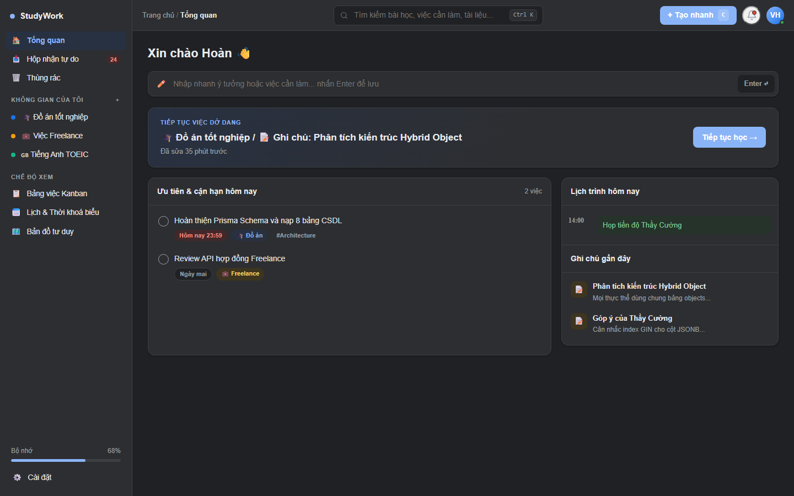

2. **Chi tiết Không gian (Unified Stream & Tabs):**  
   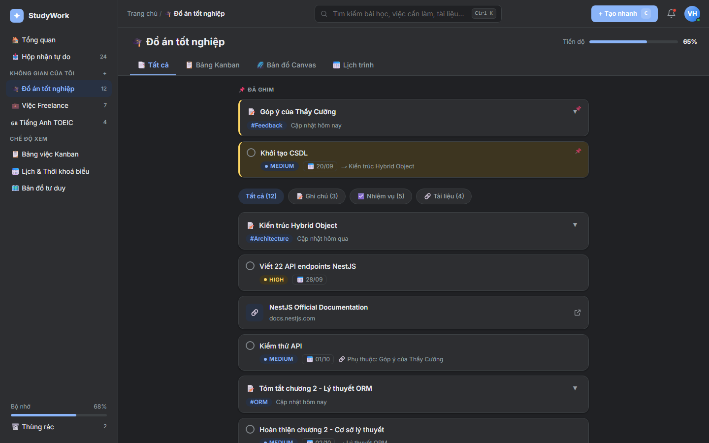

3. **Bảng công việc Kanban (Side-peek Drawer):**  
   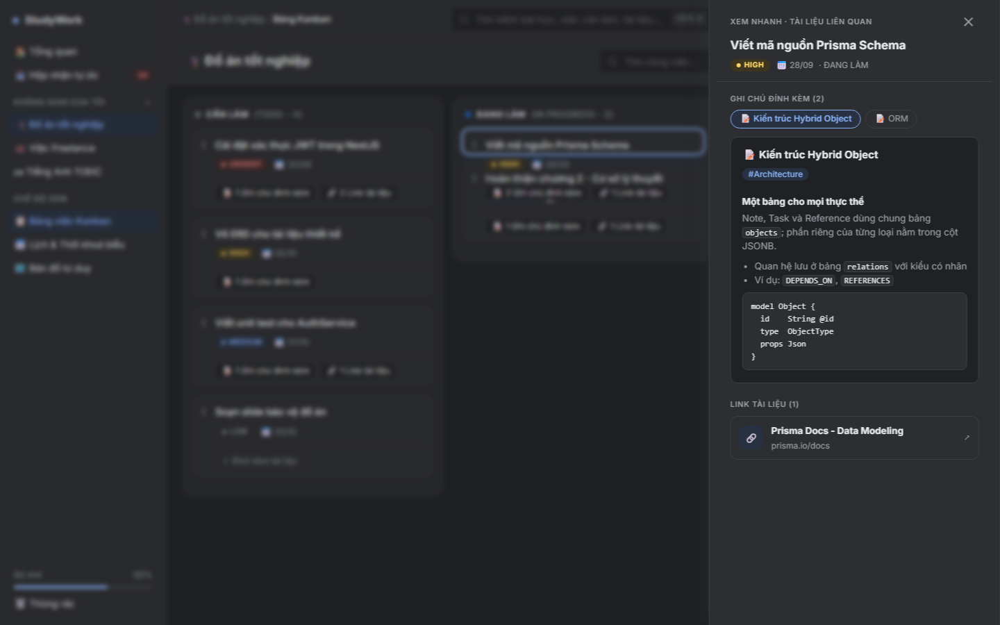

4. **Lịch trình & Thời khóa biểu (Weekly Calendar):**  
   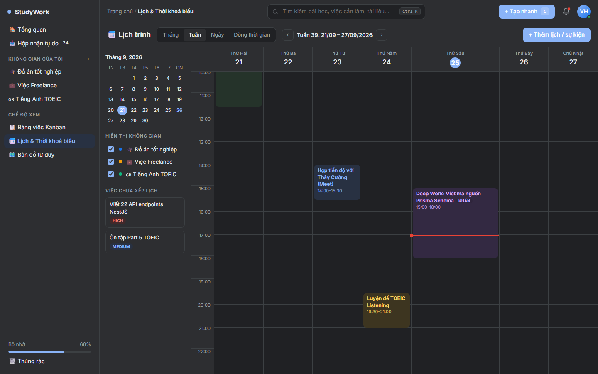

5. **Mặt phẳng tư duy vô cực (Zen Canvas):**  
   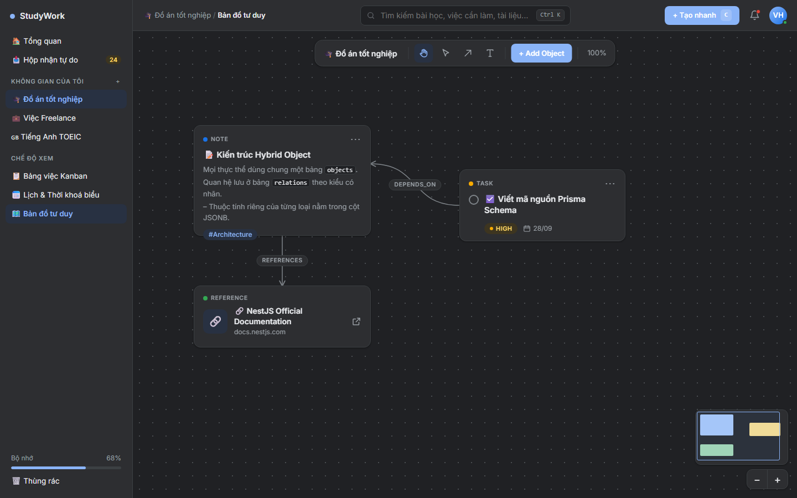

6. **Hộp thoại Chi tiết Object & Liên kết chéo:**  
   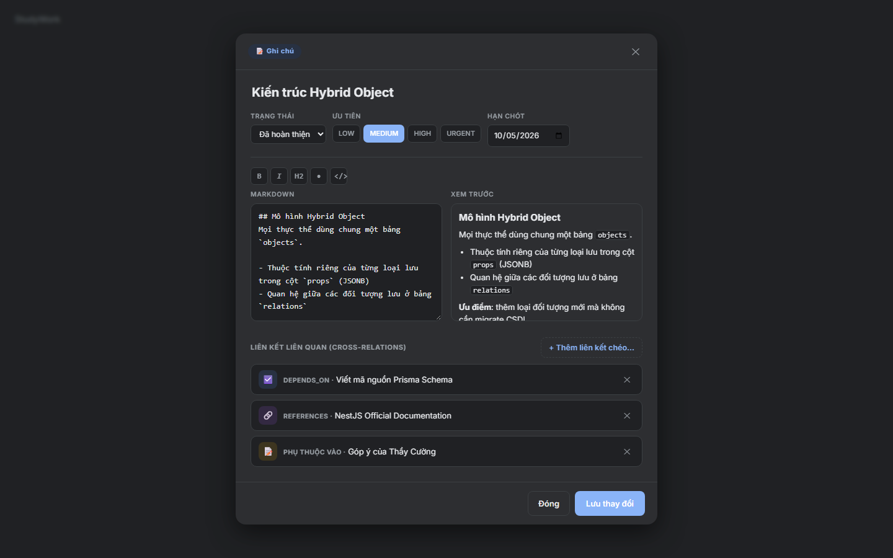

7. **Hộp nhận tự do (Unassigned Inbox):**  
   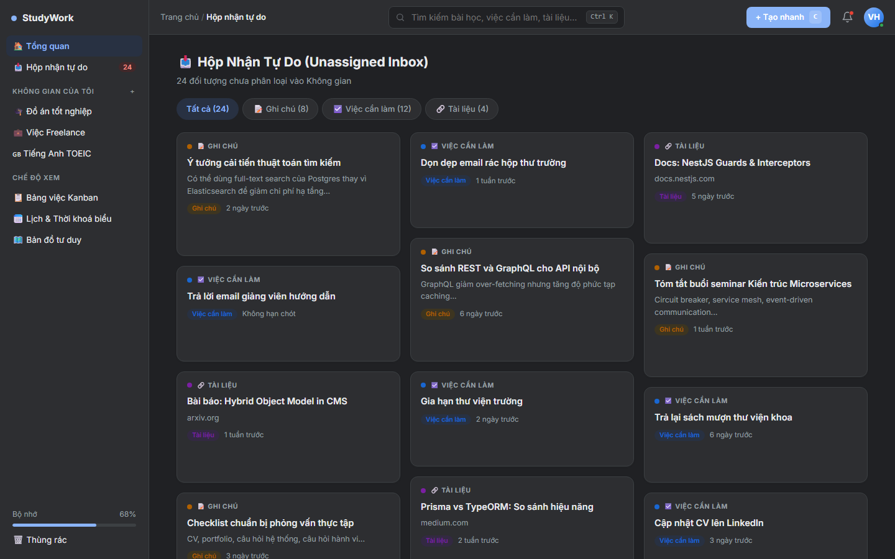

8. **Giao diện Di động (Mobile View):**  
   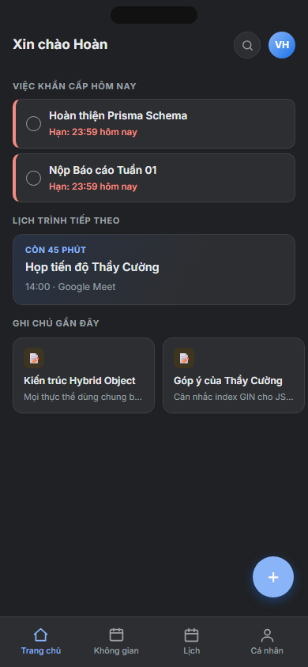

9. **Chế độ tập trung sâu (Zen Focus Mode):**  
   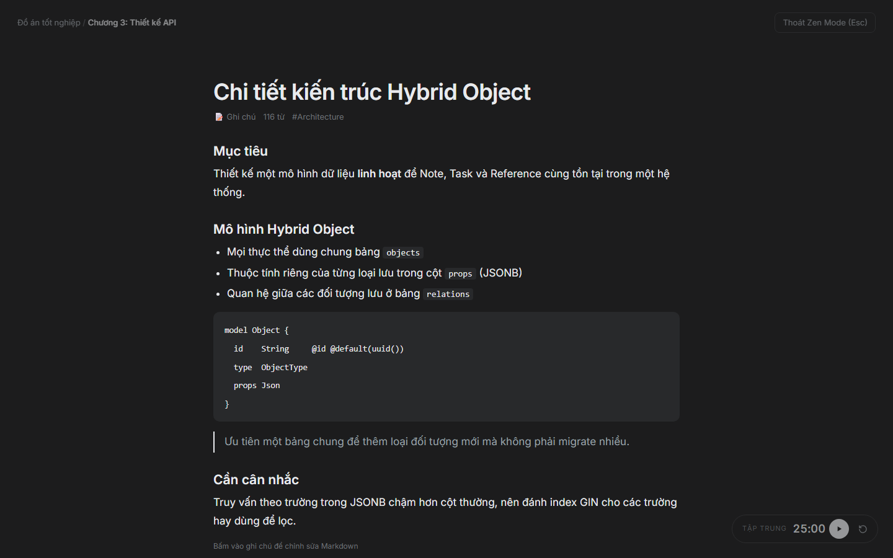

10. **Thùng rác & Lưu trữ (Trash):**  
    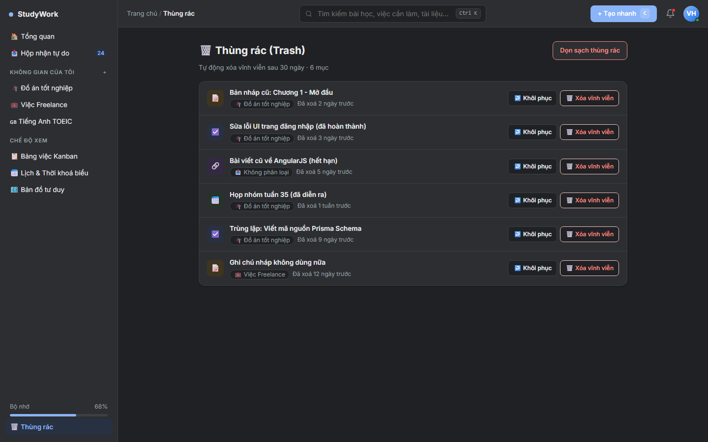

11. **Màn hình Đăng nhập (Google Neutral Auth):**  
    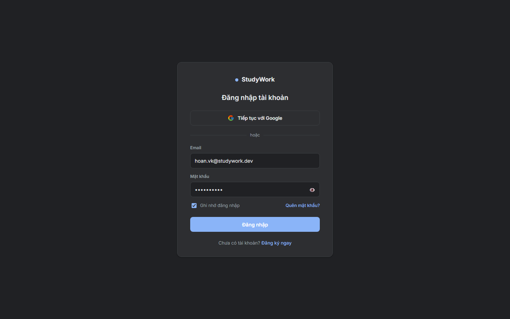

---

*Tài liệu tiếp theo: [09_Implementation.md](09_Implementation.md)*  
*Quay lại mục lục: [docs/README.md](README.md)*
