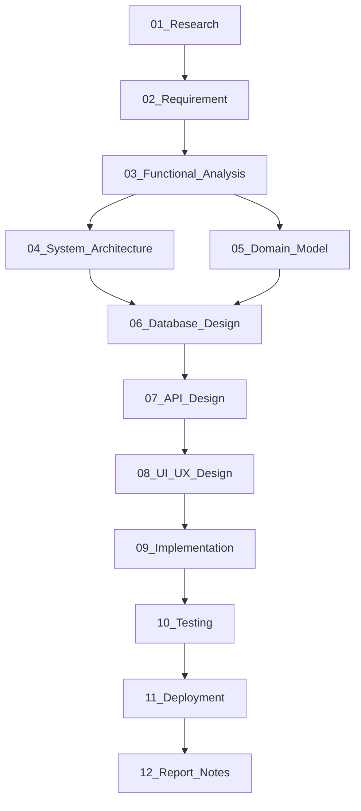

# Tài liệu Phân tích & Thiết kế

> Đây là cổng mục lục dẫn đến toàn bộ 12 tài liệu phân tích & thiết kế của đồ án.  
> Mỗi tài liệu ra đời từ tài liệu trước — không có tài liệu nào là độc lập.

---

## Tiến độ

| # | Tài liệu | Tầng | Trạng thái |
|---|---|---|---|
| 01 | [01_Research.md](01_Research.md) | Business | ✅ Hoàn thành |
| 02 | [02_Requirement.md](02_Requirement.md) | Business | ⬜ Chưa bắt đầu |
| 03 | [03_Functional_Analysis.md](03_Functional_Analysis.md) | Business | ⬜ Chưa bắt đầu |
| 04 | [04_System_Architecture.md](04_System_Architecture.md) | Design | ⬜ Chưa bắt đầu |
| 05 | [05_Domain_Model.md](05_Domain_Model.md) | Design | ⬜ Chưa bắt đầu |
| 06 | [06_Database_Design.md](06_Database_Design.md) | Design | ⬜ Chưa bắt đầu |
| 07 | [07_API_Design.md](07_API_Design.md) | Design | ⬜ Chưa bắt đầu |
| 08 | [08_UI_UX_Design.md](08_UI_UX_Design.md) | Design | ⬜ Chưa bắt đầu |
| 09 | [09_Implementation.md](09_Implementation.md) | Development | ⬜ Chưa bắt đầu |
| 10 | [10_Testing.md](10_Testing.md) | Development | ⬜ Chưa bắt đầu |
| 11 | [11_Deployment.md](11_Deployment.md) | Development | ⬜ Chưa bắt đầu |
| 12 | [12_Report_Notes.md](12_Report_Notes.md) | Development | ⬜ Chưa bắt đầu |

> **Cập nhật ô trạng thái** khi hoàn thành mỗi tài liệu:  
> ⬜ Chưa bắt đầu → 🔄 Đang làm → ✅ Hoàn thành

---

## Chuỗi phụ thuộc



> ⚠️ **Quy tắc vàng:** Không bắt đầu tài liệu tiếp theo khi tài liệu hiện tại chưa đủ nội dung để làm căn cứ.  
> Không mở VS Code code backend khi `07_API_Design.md` chưa có nội dung.

---

## Tóm tắt từng tài liệu

### 📘 Tầng 1 — Business (Phân tích nghiệp vụ)

**[01_Research.md](01_Research.md)** — Xác định bài toán  
Bối cảnh, giải pháp hiện có, người dùng mục tiêu, personas, pain points, problem statement, objectives, scope.  
→ *Làm căn cứ cho: 02_Requirement.md*

**[02_Requirement.md](02_Requirement.md)** — Yêu cầu hệ thống  
Functional Requirements (FR-AUTH-xx, FR-TASK-xx...), Non-Functional Requirements, Business Rules tổng quan.  
→ *Làm căn cứ cho: 03_Functional_Analysis.md*

**[03_Functional_Analysis.md](03_Functional_Analysis.md)** — Phân tích chức năng  
User Stories (~30), Use Case Diagram + chi tiết, Feature Matrix (bảng chéo Module × Chức năng).  
→ *Làm căn cứ cho: 04_System_Architecture.md, 05_Domain_Model.md*

---

### 📗 Tầng 2 — Design (Thiết kế hệ thống)

**[04_System_Architecture.md](04_System_Architecture.md)** — Kiến trúc hệ thống  
Context Diagram, High-Level Architecture, Module List & Dependency, Decision Log (vì sao chọn PostgreSQL, NestJS...).  
→ *Làm căn cứ cho: 06_Database_Design.md*

**[05_Domain_Model.md](05_Domain_Model.md)** — Mô hình nghiệp vụ  
Domain Entities & quan hệ (thuần nghiệp vụ, chưa nghĩ tới database), Domain Glossary.  
→ *Làm căn cứ cho: 06_Database_Design.md*

**[06_Database_Design.md](06_Database_Design.md)** — Thiết kế cơ sở dữ liệu  
ERD mức Logic → ERD mức Physical (từ Prisma), Data Dictionary (từng field, kiểu, ràng buộc, ý nghĩa).  
→ *Làm căn cứ cho: 07_API_Design.md*

**[07_API_Design.md](07_API_Design.md)** — Thiết kế API  
Danh sách endpoint theo module, Business Rules chi tiết từng API, quy trình API → DTO → Swagger.  
→ *Làm căn cứ cho: 08_UI_UX_Design.md, 09_Implementation.md*

**[08_UI_UX_Design.md](08_UI_UX_Design.md)** — Thiết kế giao diện  
Sitemap, User Flow, Wireframe → Prototype (link Figma), Design System, Component List, Responsive notes.  
→ *Làm căn cứ cho: 09_Implementation.md*

---

### 📙 Tầng 3 — Development (Xây dựng & triển khai)

**[09_Implementation.md](09_Implementation.md)** — Ghi chú triển khai  
Folder Structure, Module Structure, Repository Pattern, DTO, Validation, Exception handling, Logging.

**[10_Testing.md](10_Testing.md)** — Kiểm thử  
Unit Test, Integration Test, Manual Test, Acceptance Test, Test Cases.

**[11_Deployment.md](11_Deployment.md)** — Triển khai  
Môi trường, CI/CD (nếu có), hướng dẫn deploy lên server/cloud.

**[12_Report_Notes.md](12_Report_Notes.md)** — Ghi chú cho báo cáo  
Hình ảnh, số liệu, kết quả cần dùng khi viết báo cáo chính thức.

---

## Quy tắc viết tài liệu

### Header chuẩn (đầu mỗi file)
```markdown
> **Tầng:** Business / Design / Development  
> **Phụ thuộc vào:** [XX_TenTaiLieu.md](XX_TenTaiLieu.md) — [lý do]  
> **Tài liệu tiếp theo:** [YY_TenTaiLieu.md](YY_TenTaiLieu.md)  
> **Trạng thái:** 🔄 Đang viết / ✅ Hoàn thành  
> **Cập nhật lần cuối:** YYYY-MM-DD
```

### Footer chuẩn (cuối mỗi file)
```markdown
---
*Tài liệu tiếp theo trong chuỗi: [YY_TenTaiLieu.md](YY_TenTaiLieu.md)*  
*Quay lại mục lục: [docs/README.md](README.md)*
```

### Cách tham chiếu requirement trong code
```typescript
// REF: FR-TASK-01 (docs/02_Requirement.md#fr-task-01)
// Validate: dueDate không được nhỏ hơn ngày tạo
```

---

## Diagrams

File draw.io được lưu trong `../diagrams/`. Khi viết tài liệu, nhúng ảnh đã export:

```markdown

```

*(Xem [diagrams/README.md](../diagrams/README.md) để biết cách export từ draw.io)*

---

*Quay lại: [README.md gốc project](../README.md)*
