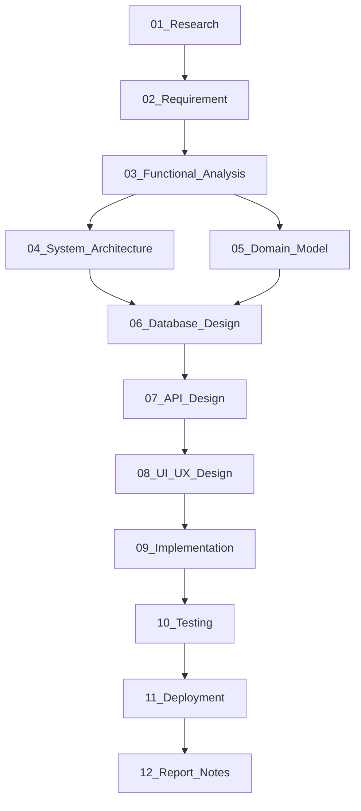

# Tài liệu phân tích & thiết kế

Thư mục này chứa toàn bộ tài liệu phân tích và thiết kế của đồ án, được viết theo thứ tự từ trên xuống — mỗi tài liệu làm căn cứ cho tài liệu tiếp theo. Cách tổ chức này giúp mình (và sau này là hội đồng) có thể truy ngược lại lý do của bất kỳ quyết định nào trong code.

---

## Tiến độ

| File | Nội dung | Trạng thái |
|---|---|---|
| [01_Research.md](01_Research.md) | Khảo sát bài toán — tại sao cần làm đề tài này | ✅ Xong |
| [02_Requirement.md](02_Requirement.md) | Danh sách yêu cầu chức năng và phi chức năng | ⬜ Chưa làm |
| [03_Functional_Analysis.md](03_Functional_Analysis.md) | User story, use case, bảng tổng hợp chức năng | ⬜ Chưa làm |
| [04_System_Architecture.md](04_System_Architecture.md) | Kiến trúc hệ thống, lý do chọn công nghệ | ⬜ Chưa làm |
| [05_Domain_Model.md](05_Domain_Model.md) | Các khái niệm nghiệp vụ và quan hệ giữa chúng | ⬜ Chưa làm |
| [06_Database_Design.md](06_Database_Design.md) | Thiết kế database, giải thích từng bảng/cột | ⬜ Chưa làm |
| [07_API_Design.md](07_API_Design.md) | Danh sách API, quy tắc nghiệp vụ từng endpoint | ⬜ Chưa làm |
| [08_UI_UX_Design.md](08_UI_UX_Design.md) | Sitemap, user flow, link Figma | ⬜ Chưa làm |
| [09_Implementation.md](09_Implementation.md) | Ghi chú kỹ thuật trong quá trình code | ⬜ Chưa làm |
| [10_Testing.md](10_Testing.md) | Kết quả kiểm thử | ⬜ Chưa làm |
| [11_Deployment.md](11_Deployment.md) | Cách deploy, môi trường | ⬜ Chưa làm |
| [12_Report_Notes.md](12_Report_Notes.md) | Tổng hợp số liệu, ảnh dùng khi viết báo cáo | ⬜ Chưa làm |

Khi bắt đầu một file thì đổi sang 🔄, xong thì đổi sang ✅.

---

## Thứ tự phụ thuộc

Sơ đồ dưới cho thấy file nào cần xong trước mới làm được file nào:

Nguyên tắc chung: **không code khi chưa xong thiết kế**. Cụ thể là không mở VS Code để viết backend khi `07_API_Design.md` còn trống.

---

## Tóm tắt nội dung từng file

**01_Research** — Phần này trả lời câu hỏi: tại sao cần làm đề tài này? Ai sẽ dùng? Vấn đề thực tế là gì? Đây là tài liệu đầu tiên và là nền tảng cho mọi thứ sau.

**02_Requirement** — Chuyển những vấn đề ở file 01 thành danh sách yêu cầu cụ thể, đặt ID để tiện tham chiếu sau này (ví dụ FR-TASK-01). Cả yêu cầu chức năng lẫn phi chức năng.

**03_Functional_Analysis** — Viết lại yêu cầu dưới dạng user story và use case. Có thêm bảng tổng hợp để kiểm tra không bỏ sót chức năng nào khi code.

**04_System_Architecture** — Mô tả hệ thống trông như thế nào ở tầng cao: các thành phần gồm những gì, giao tiếp ra sao. Có phần giải thích lý do chọn PostgreSQL thay vì MongoDB, tại sao dùng NestJS... để trả lời câu hỏi của hội đồng.

**05_Domain_Model** — Trước khi thiết kế database, cần xác định rõ các khái niệm nghiệp vụ. Task khác Learning ở điểm nào? CalendarEvent là gì? File này định nghĩa rõ để tránh nhầm lẫn về sau.

**06_Database_Design** — Từ domain model ở file 05, ánh xạ sang các bảng database thực tế. Có giải thích từng cột để sau này viết báo cáo khỏi bị hỏi "cột này để làm gì".

**07_API_Design** — Danh sách endpoint, cấu trúc request/response, và quan trọng hơn là các quy tắc nghiệp vụ của từng API — những thứ mà Swagger không diễn đạt được.

**08_UI_UX_Design** — Sitemap, luồng người dùng, link Figma. File này chỉ lưu link, không commit file Figma.

**09–12** — Viết trong và sau khi code xong.

---

## Một số quy tắc khi viết

- Mỗi file bắt đầu bằng một dòng ghi rõ file này phụ thuộc vào file nào và làm căn cứ cho file nào. Dễ truy ngược.
- Phần nội dung mà mình chưa chắc thì để comment `<!-- TODO -->` thay vì bỏ trống hoặc điền đại.
- Diagram vẽ bằng draw.io, export ra PNG rồi nhúng vào — xem hướng dẫn ở [diagrams/README.md](../diagrams/README.md).

---

*Quay lại: [README.md](../README.md)*
