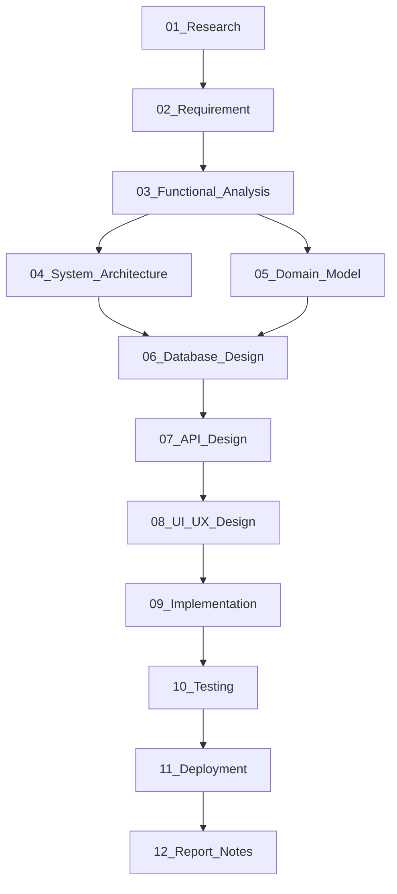

# Tài liệu Phân tích & Thiết kế

Thư mục này chứa toàn bộ 12 tài liệu phân tích và thiết kế của đồ án. Các tài liệu được xây dựng theo chuỗi phụ thuộc nối tiếp nhau — mỗi tài liệu ra đời làm căn cứ cho tài liệu tiếp theo.

Quy định về quy tắc commit, đặt tên file và quy trình làm việc chung: Xem tại [Workflow.md](Workflow.md).

---

## 1. Bảng tiến độ tài liệu

| File | Nội dung chính | Trạng thái |
|---|---|---|
| [01_Research.md](01_Research.md) | Khảo sát bài toán, đối tượng sử dụng, vấn đề thực tế | Đang làm |
| [02_Requirement.md](02_Requirement.md) | Danh sách yêu cầu chức năng (FR) và phi chức năng (NFR) | Chưa làm |
| [03_Functional_Analysis.md](03_Functional_Analysis.md) | User Stories, chi tiết Use Case, Feature Matrix | Chưa làm |
| [04_System_Architecture.md](04_System_Architecture.md) | Kiến trúc hệ thống, danh sách module, Decision Log | Chưa làm |
| [05_Domain_Model.md](05_Domain_Model.md) | Các thực thể nghiệp vụ (Entities) và Domain Glossary | Chưa làm |
| [06_Database_Design.md](06_Database_Design.md) | Sơ đồ ERD, Từ điển dữ liệu (Data Dictionary) | Chưa làm |
| [07_API_Design.md](07_API_Design.md) | Danh sách API Endpoints và Quy tắc nghiệp vụ | Chưa làm |
| [08_UI_UX_Design.md](08_UI_UX_Design.md) | Sitemap, User Flow, Link Figma & Design System | Chưa làm |
| [09_Implementation.md](09_Implementation.md) | Ghi chú kỹ thuật triển khai mã nguồn | Chưa làm |
| [10_Testing.md](10_Testing.md) | Kế hoạch và kết quả kiểm thử | Chưa làm |
| [11_Deployment.md](11_Deployment.md) | Hướng dẫn triển khai ứng dụng | Chưa làm |
| [12_Report_Notes.md](12_Report_Notes.md) | Tổng hợp số liệu và hình ảnh phục vụ viết báo cáo | Chưa làm |

*Quy ước trạng thái:* Chưa làm → Đang làm → Xong

---

## 2. Chuỗi phụ thuộc giữa các tài liệu

---

## 3. Tóm tắt nội dung từng tài liệu

- **01_Research**: Xác định bối cảnh, đối tượng sử dụng, khó khăn thực tế (Pain Points) và mục tiêu đề tài.
- **02_Requirement**: Định nghĩa các yêu cầu chức năng (FR) và phi chức năng (NFR) kèm mã định danh (ID).
- **03_Functional_Analysis**: Chuyển đổi yêu cầu thành User Stories, mô tả chi tiết Use Cases và xây dựng Feature Matrix.
- **04_System_Architecture**: Thiết kế sơ đồ kiến trúc tổng quan, phân chia module và giải thích lý do lựa chọn công nghệ.
- **05_Domain_Model**: Xây dựng mô hình nghiệp vụ, từ điển thuật ngữ (Domain Glossary) độc lập với cơ sở dữ liệu.
- **06_Database_Design**: Chuyển đổi Domain Model thành ERD (Logic & Physical) và xây dựng Data Dictionary cho từng bảng.
- **07_API_Design**: Thiết kế chuẩn các API endpoints, cấu trúc dữ liệu gửi/nhận và quy tắc nghiệp vụ (Business Rules).
- **08_UI_UX_Design**: Xây dựng Sitemap, User Flow, danh sách UI components và liên kết tới thiết kế Figma.
- **09_Implementation**: Ghi nhận các pattern lập trình, cấu trúc thư mục code thực tế và ghi chú kỹ thuật.
- **10_Testing**: Xây dựng kịch bản kiểm thử (Unit test, Integration test, Manual test) và ghi nhận kết quả.
- **11_Deployment**: Hướng dẫn cấu hình môi trường và triển khai ứng dụng.
- **12_Report_Notes**: Tổng hợp số liệu, danh sách hình ảnh cần chụp để chuẩn bị viết báo cáo tốt nghiệp.

---

*Quay lại: [README.md](../README.md)*
