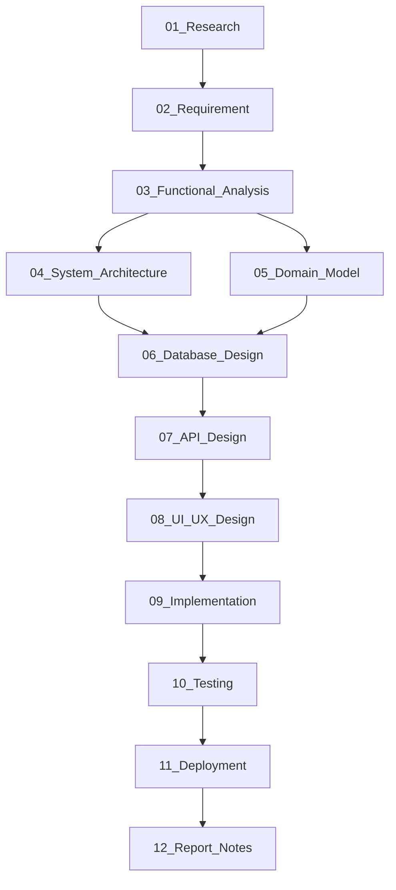

# Tài liệu Phân tích & Thiết kế

Thư mục này chứa toàn bộ 12 tài liệu phân tích và thiết kế của đồ án. Các tài liệu được xây dựng theo chuỗi phụ thuộc nối tiếp nhau — mỗi tài liệu ra đời làm căn cứ cho tài liệu tiếp theo.

Quy định về quy tắc commit, đặt tên file và quy trình làm việc chung: Xem tại [Workflow.md](Workflow.md).

---

## 1. Bảng tiến độ tài liệu

| File | Nội dung chính | Trạng thái |
| --- | --- | --- |
| [01_Research.md](01_Research.md) | Khảo sát bài toán, đối tượng sử dụng, vấn đề thực tế | Hoàn thành |
| [02_Requirement.md](02_Requirement.md) | Danh sách yêu cầu chức năng (FR) và phi chức năng (NFR) | Hoàn thành |
| [03_Functional_Analysis.md](03_Functional_Analysis.md) | User Stories, chi tiết Use Case, Feature Matrix | Hoàn thành |
| [04_System_Architecture.md](04_System_Architecture.md) | Kiến trúc hệ thống, sơ đồ phân tầng, Decision Log | Hoàn thành |
| [05_Domain_Model.md](05_Domain_Model.md) | Các thực thể nghiệp vụ (Entities) và Domain Glossary | Hoàn thành |
| [06_Database_Design.md](06_Database_Design.md) | Sơ đồ ERD chuẩn hóa 8 bảng, Từ điển dữ liệu | Hoàn thành |
| [07_API_Design.md](07_API_Design.md) | Danh sách API Endpoints RESTful và Quy tắc nghiệp vụ | Hoàn thành |
| [08_UI_UX_Design.md](08_UI_UX_Design.md) | Sitemap, User Flow, Link Figma & Design System | Hoàn thành |
| [09_Implementation.md](09_Implementation.md) | Ghi chú kỹ thuật triển khai mã nguồn | Hoàn thành |
| [10_Testing.md](10_Testing.md) | Kế hoạch và kịch bản kiểm thử hệ thống | Hoàn thành |
| [11_Deployment.md](11_Deployment.md) | Hướng dẫn cấu hình môi trường và triển khai ứng dụng | Hoàn thành |
| [12_Report_Notes.md](12_Report_Notes.md) | Tổng hợp số liệu và hình ảnh phục vụ viết báo cáo | Hoàn thành |

---

## 2. Liên kết giữa các tài liệu

```mermaid
graph TD
    A[01_Research] --> B[02_Requirement]
    B --> C[03_Functional_Analysis]
    C --> D[04_System_Architecture]
    C --> E[05_Domain_Model]
    D --> F[06_Database_Design]
    E --> F
    F --> G[07_API_Design]
    G --> H[08_UI_UX_Design]
    H --> I[09_Implementation]
    I --> J[10_Testing]
    J --> K[11_Deployment]
    K --> L[12_Report_Notes]
```

---

## 3. Tóm tắt nội dung từng tài liệu

- **01_Research:** Khảo sát bài toán quản lý cá nhân, xác định các khó khăn thực tế (Pain Points) và mục tiêu đề tài. Định hình mô hình Không gian linh hoạt (Spaces).
- **02_Requirement:** Định nghĩa 11 nhóm yêu cầu chức năng (FR) và phi chức năng (NFR) kèm mã định danh chi tiết.
- **03_Functional_Analysis:** Chuyển đổi yêu cầu thành User Stories, 18 Use Cases và 6 sơ đồ hoạt động (Activity Diagrams).
- **04_System_Architecture:** Thiết kế kiến trúc tổng quan (Context Diagram, Kiến trúc phân tầng Layered), phân chia module và Decision Log giải thích lựa chọn công nghệ.
- **05_Domain_Model:** Xây dựng mô hình nghiệp vụ gồm User, Space, Object (Task/Note/Event/Reference), Placement, Relation kèm Domain Glossary độc lập với CSDL.
- **06_Database_Design:** Sơ đồ CSDL quan hệ chuẩn hóa 8 bảng (PostgreSQL & Prisma), ràng buộc toàn vẹn và Data Dictionary chi tiết từng trường.
- **07_API_Design:** Danh sách 22 endpoints RESTful chuẩn mực cho Auth, Space, Object, Placement, Relation, View kèm Business Rules kiểm soát dữ liệu.
- **08_UI_UX_Design:** Triết lý thiết kế tối giản, Sitemap, User Flow, liên kết Figma và 13 ảnh wireframe giao diện thực tế.
- **09_Implementation:** Hướng dẫn cấu trúc mã nguồn Backend (NestJS), Frontend (Next.js 14) và các quy chuẩn lập trình thực tế.
- **10_Testing:** Chiến lược và kịch bản kiểm thử (Unit test Jest, Integration test, E2E test).
- **11_Deployment:** Hướng dẫn cấu hình môi trường Docker, biến môi trường và quy trình đóng gói triển khai.
- **12_Report_Notes:** Tổng hợp số liệu cốt lõi, danh sách ảnh chụp giao diện và các điểm nổi bật để bảo vệ đồ án tốt nghiệp.

---

*Quay lại: [README.md](../README.md)*
